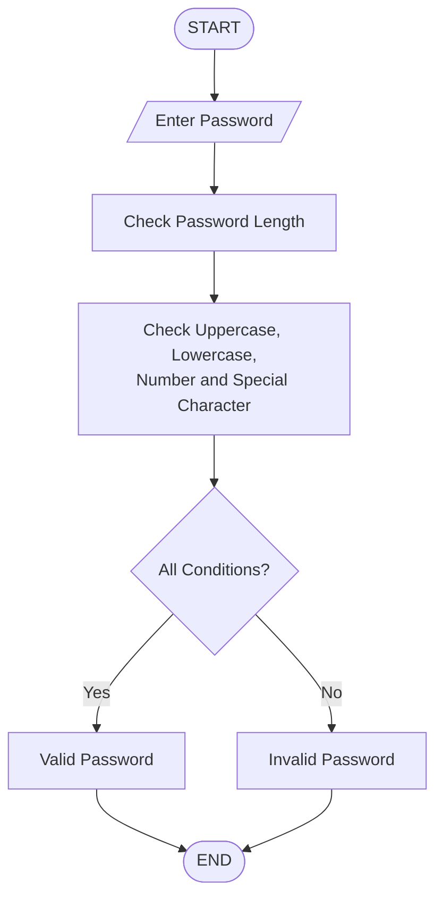

## Password Validator

## 1. Problem Statement

Develop a Python program to validate passwords based on predefined security criteria.

## 2. Algorithm

1. Start the program.
2. Accept password from the user.
3. Check password length.
4. Check whether password contains uppercase letters.
5. Check whether password contains lowercase letters.
6. Check whether password contains numbers.
7. Check whether password contains special characters.
8. If all conditions satisfy, display "Valid Password".
9. Otherwise display "Invalid Password".
10. Stop.

## 3. Flowchart

## 4. Source Code

import string

password = input("Enter password: ")

if (len(password) >= 8 and
    any(char.isupper() for char in password) and
    any(char.islower() for char in password) and
    any(char.isdigit() for char in password) and
    any(char in string.punctuation for char in password)):

    print("Valid Password")

else:
    print("Invalid Password")

## 5. Sample Input
Enter password: Python@123

## 6. Sample Output
Valid Password

## 7. Screenshot 
