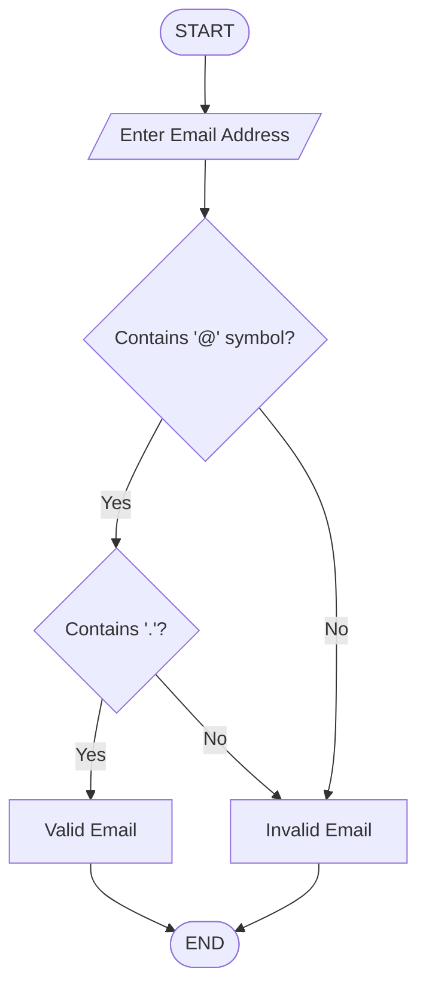

## Email Address Validator

## 1. Problem Statement

Develop a Python program to validate email addresses entered by users.

## 2. Algorithm

1. Start the program.
2. Accept an email address from the user.
3. Check whether the email contains "@" symbol.
4. Check whether the email contains "." after "@".
5. Check whether the email starts and ends with valid characters.
6. If all conditions are satisfied, display "Valid Email Address".
7. Otherwise display "Invalid Email Address".
8. Stop the program.

## 3. Flowchart

## 4. Source Code

email = input("Enter email address: ")

if "@" in email and "." in email and email.index("@") < email.rindex("."):
    print("Valid Email Address")

else:
    print("Invalid Email Address")

## 5. Sample Input
Enter email address: student@gmail.com

## 6. Sample Output
Valid Email Address

## 7.Screenshot 
