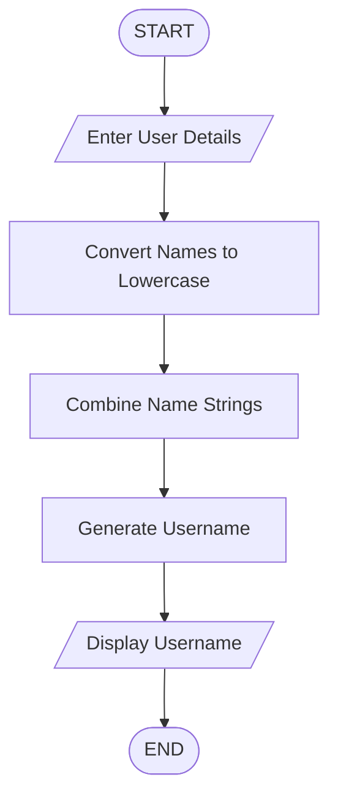

## Username Generator

## 1. Problem Statement

Develop a Python program to generate usernames using personal information provided by users.

## 2. Algorithm

1. Start the program.
2. Get first name and last name from the user.
3. Convert the names into lowercase.
4. Combine the first name and last name.
5. Generate a username.
6. Display the generated username.
7. Stop.

## 3. Flowchart

## 4. Source Code

first_name = input("Enter first name: ")
last_name = input("Enter last name: ")

username = first_name.lower() + "_" + last_name.lower()

print("Generated Username:", username)

## 5. Sample Input
Enter first name: Nagalakshmi
Enter last name: Uppe

## 6. Sample Output
Generated Username: nagalakshmi_uppe

## 7. Screenshot 
