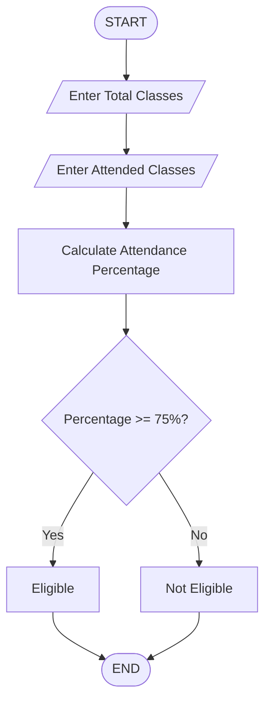

## Attendance Percentage Calculator

## 1. Problem Statement

Develop a Python program to calculate attendance percentage and determine eligibility for examinations.

## 2. Algorithm

1. Start the program.
2. Enter the total number of classes conducted.
3. Enter the number of classes attended.
4. Calculate attendance percentage.

## Formula:

Attendance Percentage=Total Classes /Classes Attended ×100

5. Compare percentage with eligibility criteria.
6. If percentage is greater than or equal to 75%, display eligible.
7. Otherwise display not eligible.
8. Stop.

## 3. Flowchart

             
## 4. Source Code

total_classes = int(input("Enter total classes: "))
attended_classes = int(input("Enter attended classes: "))

percentage = (attended_classes / total_classes) * 100

print("Attendance Percentage:", percentage)

if percentage >= 75:
    print("Eligible for Examination")

else:
    print("Not Eligible for Examination")

## 5. Sample Input
Enter total classes: 100
Enter attended classes: 85

## 6. Sample Output
Attendance Percentage: 85.0
Eligible for Examination

## 7.Screenshot 
