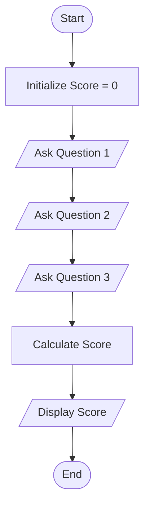
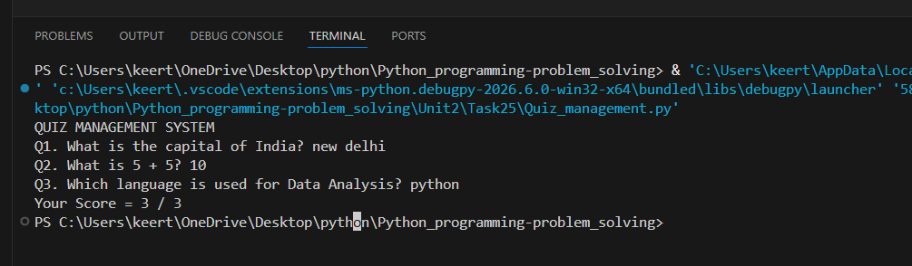

# Tutorial Task 25: Quiz Management System

## 1. Problem Statement

Develop a Python program to conduct a quiz and calculate the participant's score.

---

## 2. Algorithm

1. Start
2. Initialize score as 0
3. Ask Question 1 and check answer
4. Ask Question 2 and check answer
5. Ask Question 3 and check answer
6. Increment score for each correct answer
7. Display final score
8. Stop

---

## 3. Flowchart



---

## 4. Python Source Code

```python
print("QUIZ MANAGEMENT SYSTEM")

score = 0

answer1 = input("Q1. What is the capital of India? ")
if answer1.lower() == "new delhi":
    score += 1

answer2 = input("Q2. What is 5 + 5? ")
if answer2 == "10":
    score += 1

answer3 = input("Q3. Which language is used for Data Analysis? ")
if answer3.lower() == "python":
    score += 1

print("Your Score =", score, "/ 3")
```

---

## 5. Sample Input

```text
New Delhi
10
Python
```

---

## 6. Sample Output

```text
Your Score = 3 / 3
```

---

## 7. Screenshot



---

## 8. Explanation

The program conducts a simple quiz, evaluates the answers, and calculates the final score.

---

## 9. Software Requirements

- Python 3.x
- Visual Studio Code
- GitHub