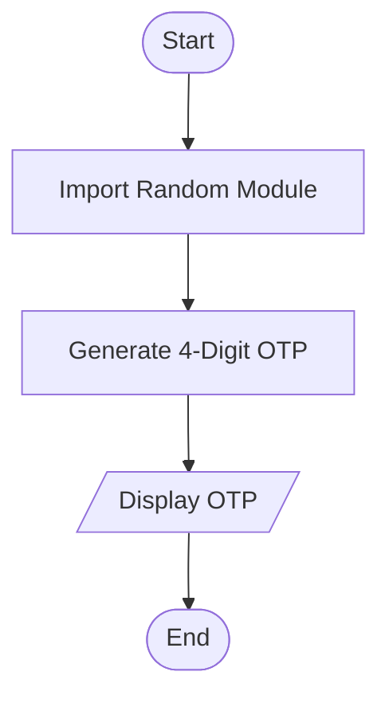
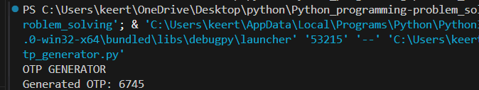

# Tutorial Task 26: OTP Generator

## 1. Problem Statement

Develop a Python program to generate one-time passwords for user authentication.

---

## 2. Algorithm

1. Start
2. Import random module
3. Generate a random 4-digit OTP
4. Display OTP
5. Stop

---

## 3. Flowchart



---

## 4. Python Source Code

```python
import random

print("OTP GENERATOR")

otp = random.randint(1000, 9999)

print("Generated OTP:", otp)
```

---

## 5. Sample Input

```text
No Input Required
```

---

## 6. Sample Output

```text
Generated OTP: 5832
```

---

## 7. Screenshot



---

## 8. Explanation

The program generates a random four-digit OTP using Python's random module.

---

## 9. Software Requirements

- Python 3.x
- Visual Studio Code
- GitHub