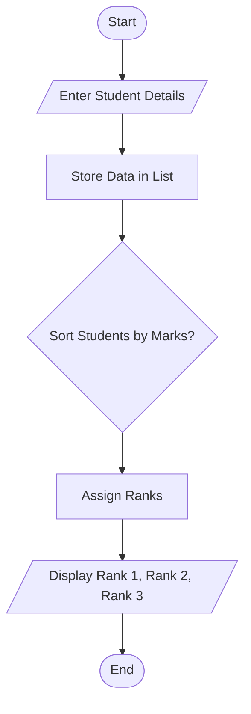
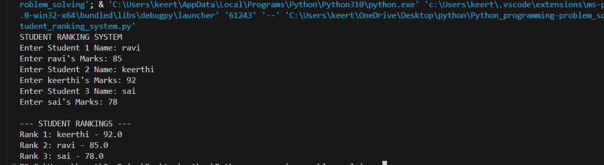

# Tutorial Task 27: Student Ranking System

## 1. Problem Statement

Develop a Python program to rank students based on marks obtained in examinations.

---

## 2. Algorithm

1. Start
2. Input names and marks of three students
3. Store student details in a list
4. Sort students based on marks in descending order
5. Assign ranks
6. Display Rank 1, Rank 2, and Rank 3
7. Stop

---

## 3. Flowchart
## 3. Flowchart



---

## 4. Python Source Code

```python
print("STUDENT RANKING SYSTEM")

students = []

for i in range(3):
    name = input(f"Enter Student {i+1} Name: ")
    marks = float(input(f"Enter {name}'s Marks: "))
    students.append([name, marks])

students.sort(key=lambda x: x[1], reverse=True)

print("\n--- STUDENT RANKINGS ---")
print("Rank 1:", students[0][0], "-", students[0][1])
print("Rank 2:", students[1][0], "-", students[1][1])
print("Rank 3:", students[2][0], "-", students[2][1])
```

---

## 5. Sample Input

```text
Enter Student 1 Name: Ravi
Enter Ravi's Marks: 85

Enter Student 2 Name: Keerthi
Enter Keerthi's Marks: 92

Enter Student 3 Name: Sai
Enter Sai's Marks: 78
```

---

## 6. Sample Output

```text
--- STUDENT RANKINGS ---

Rank 1: Keerthi - 92.0
Rank 2: Ravi - 85.0
Rank 3: Sai - 78.0
```

---

## 7. Screenshot



---

## 8. Explanation

The program accepts names and marks of students, sorts them according to marks, and displays the rankings from highest to lowest score.

---

## 9. Software Requirements

- Python 3.x
- Visual Studio Code
- GitHub