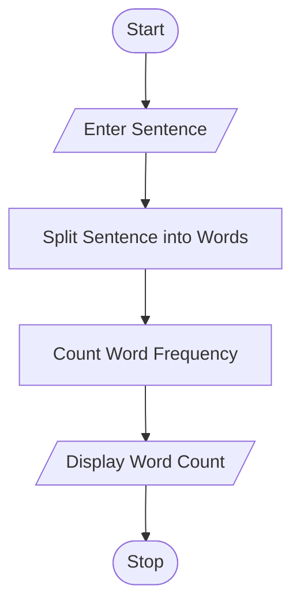
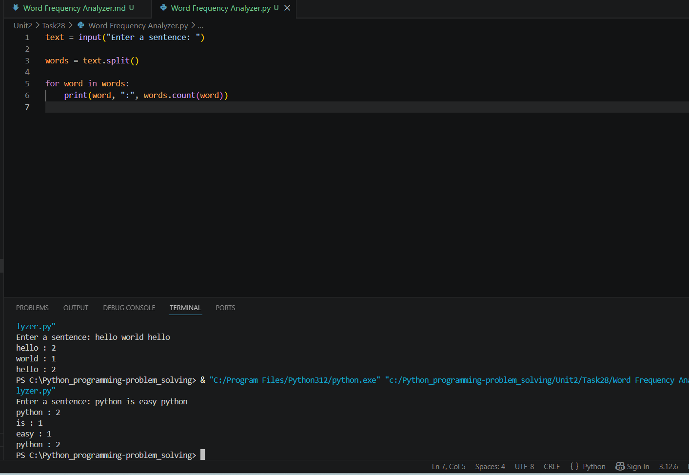

# Word Frequency Analyzer

## 1. Problem Statement

Write a Python program to analyze text and determine the frequency of each word.

The program should accept a sentence from the user, count how many times each word appears, and display the frequency.

---

## 2. Algorithm

1. Start

2. Input text from the user

3. Split the text into words

4. Check each word one by one

5. Count the frequency of each word

6. Display each word with its count

7. Stop

---

## 3. Flowchart



---

## 4. Python Source Code

```python
text = input("Enter a sentence: ")

words = text.split()

for word in words:
    print(word, ":", words.count(word))
```

---

## 5. Sample Input / Output

### Sample 1:

Input:

```text
Enter a sentence: hello world hello
```

Output:

```text
hello : 2
world : 1
hello : 2
```

### Sample 2:

Input:

```text
Enter a sentence: python is easy python
```

Output:

```text
python : 2
is : 1
easy : 1
python : 2
```

---

## 6. Screenshots


---