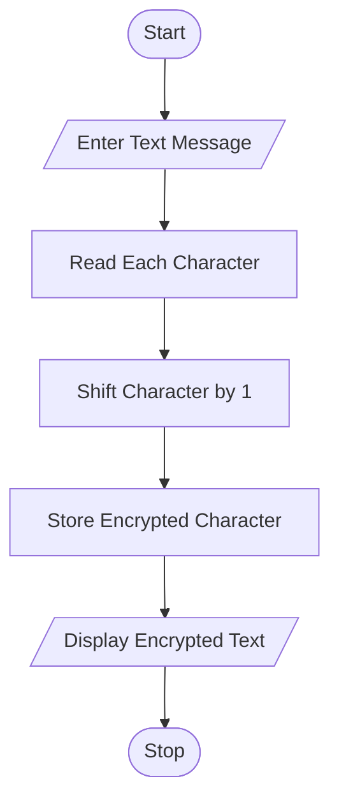
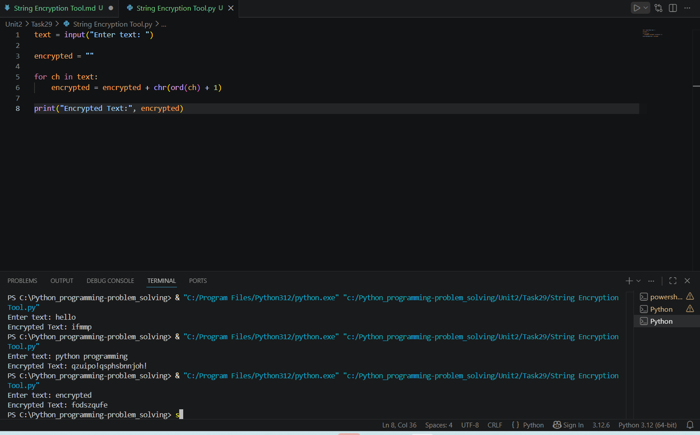

# String Encryption Tool

## 1. Problem Statement

Write a Python program to encrypt text messages using simple encryption techniques.

The program should accept a text message from the user and encrypt it by shifting each character by 1 position.

---

## 2. Algorithm

1. Start

2. Input text from the user

3. Initialize an empty encrypted string

4. For each character in the text:
   
   * Convert character into next ASCII character

5. Add encrypted character to the result

6. Display encrypted text

7. Stop

---

## 3. Flowchart



---

## 4. Python Source Code

```python
text = input("Enter text: ")

encrypted = ""

for ch in text:
    encrypted = encrypted + chr(ord(ch) + 1)

print("Encrypted Text:", encrypted)
```

---

## 5. Sample Input / Output

### Sample 1:

Input:

```text
Enter text: hello
```

Output:

```text
Encrypted Text: ifmmp
```

### Sample 2:

Input:

```text
Enter text: python
```

Output:

```text
Encrypted Text: qzuipo
```

---

## 6. Screenshots


---
