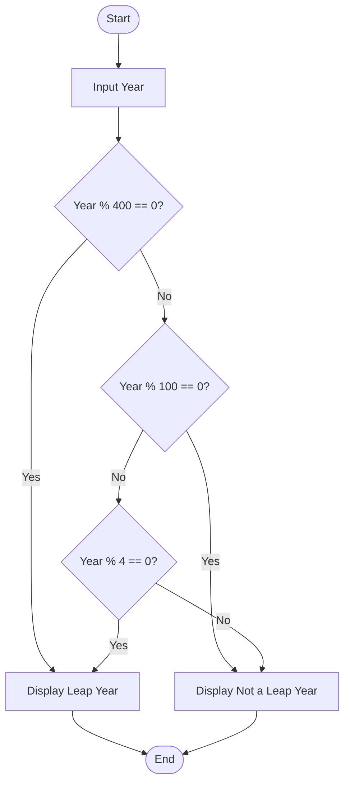

# Tutorial Task: Leap Year Checker

## Problem Statement

Develop a Python program to check whether a given year is a leap year or not.

---

## Algorithm

1. Start

2. Input a year.

3. Check the following conditions:

   * If the year is divisible by 400, it is a leap year.
   * Else if the year is divisible by 100, it is not a leap year.
   * Else if the year is divisible by 4, it is a leap year.
   * Otherwise, it is not a leap year.

4. Display the result.

5. Stop.

---

## Flowchart



---

## Python Source Code

```python
year = int(input("Enter a Year: "))

if year % 400 == 0:
    print(year, "is a Leap Year")
elif year % 100 == 0:
    print(year, "is not a Leap Year")
elif year % 4 == 0:
    print(year, "is a Leap Year")
else:
    print(year, "is not a Leap Year")
```

---

## Sample Input/Output

### Input

```text
Enter a Year: 2024
```

### Output

```text
2024 is a Leap Year
```

---

## Screenshot

> Run the program and save the output screenshot as `screenshot.png` in the repository folder.
