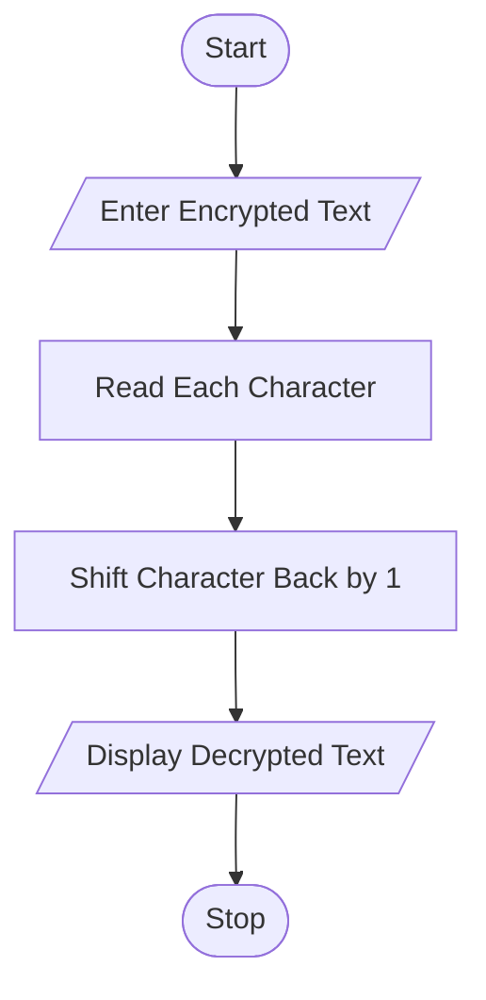
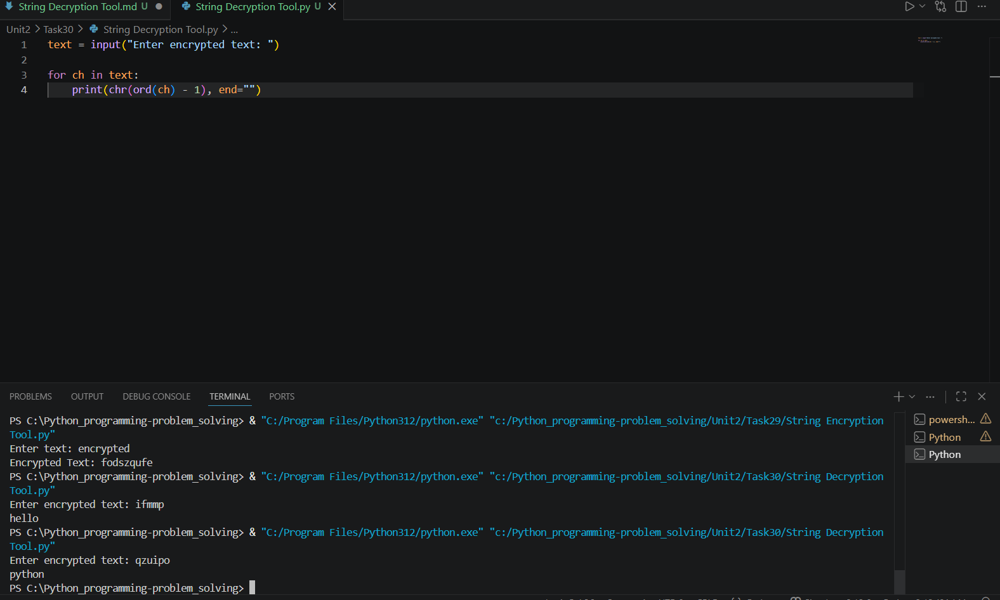

# String Decryption Tool

## 1. Problem Statement

Write a Python program to decrypt previously encrypted messages.

The program should accept an encrypted text message from the user and decrypt it by shifting each character back by 1 position.

---

## 2. Algorithm

1. Start

2. Input encrypted text from the user

3. Read each character one by one

4. Convert character into previous ASCII character

5. Display decrypted text

6. Stop

---

## 3. Flowchart



---

## 4. Python Source Code

```python
```

---

## 5. Sample Input / Output

### Sample 1:

Input:

```text
Enter encrypted text: ifmmp
```

Output:

```text
hello
```

### Sample 2:

Input:

```text
Enter encrypted text: qzuipo
```

Output:

```text
python
```

---

## 6. Screenshots


---
