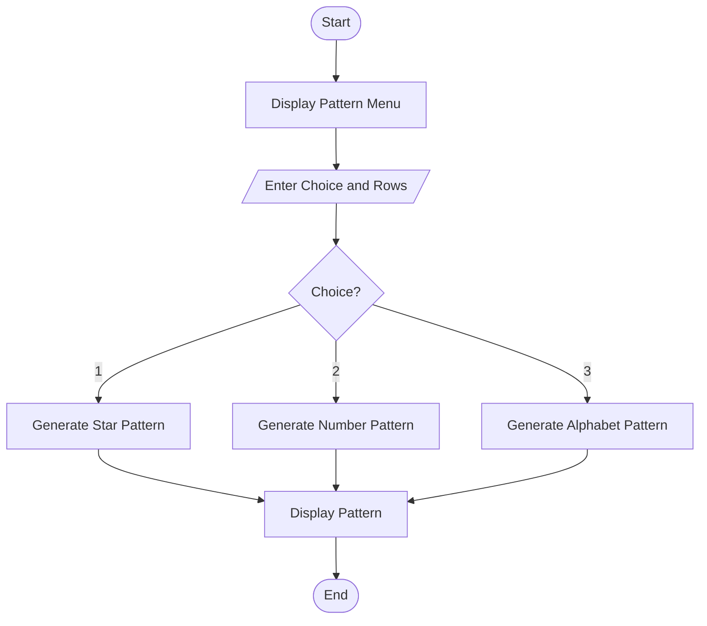
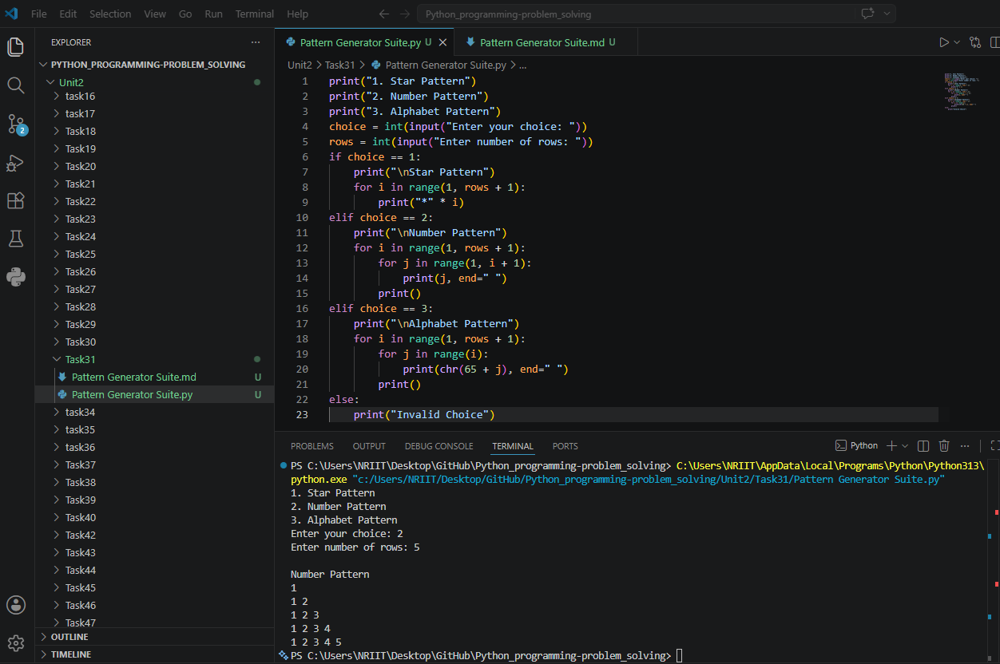

## Tutorial Task 31: Pattern Generator Suite

## 1. Problem Statement

Develop a Python program that generates multiple patterns based on 
user selection.

## 2. Algorithm

1. Start the program.
2. Display pattern menu:
3. Star Pattern
4. Number Pattern
5. Alphabet Pattern
6. Accept user choice.
7. Accept number of rows.
8. Check user's choice:
9. If 1, generate Star Pattern.
10. If 2, generate Number Pattern.
11. If 3, generate Alphabet Pattern.
12. Otherwise display "Invalid Choice".
13. Display the selected pattern.
14. End the program.

## 3. Flowchart


## 4. Python Source Code

```
print("1. Star Pattern")
print("2. Number Pattern")
print("3. Alphabet Pattern")

choice = int(input("Enter your choice: "))
rows = int(input("Enter number of rows: "))

if choice == 1:
    print("\nStar Pattern")
    for i in range(1, rows + 1):
        print("*" * i)

elif choice == 2:
    print("\nNumber Pattern")
    for i in range(1, rows + 1):
        for j in range(1, i + 1):
            print(j, end=" ")
        print()

elif choice == 3:
    print("\nAlphabet Pattern")
    for i in range(1, rows + 1):
        for j in range(i):
            print(chr(65 + j), end=" ")
        print()

else:
    print("Invalid Choice")
```

## 5. Sample Input/Output

```
Sample Run 1

1. Star Pattern
2. Number Pattern
3. Alphabet Pattern
Enter your choice: 1
Enter number of rows: 5
Star Pattern
*
**
***
****
*****

Sample Run 2

1. Star Pattern
2. Number Pattern
3. Alphabet Pattern
Enter your choice: 2
Enter number of rows: 5
Number Pattern
1
1 2
1 2 3
1 2 3 4
1 2 3 4 5

Sample Run 3

1. Star Pattern
2. Number Pattern
3. Alphabet Pattern
Enter your choice: 3
Enter number of rows: 5
Alphabet Pattern
A
A B
A B C
A B C D
A B C D E
```

## 6. Screenshots

