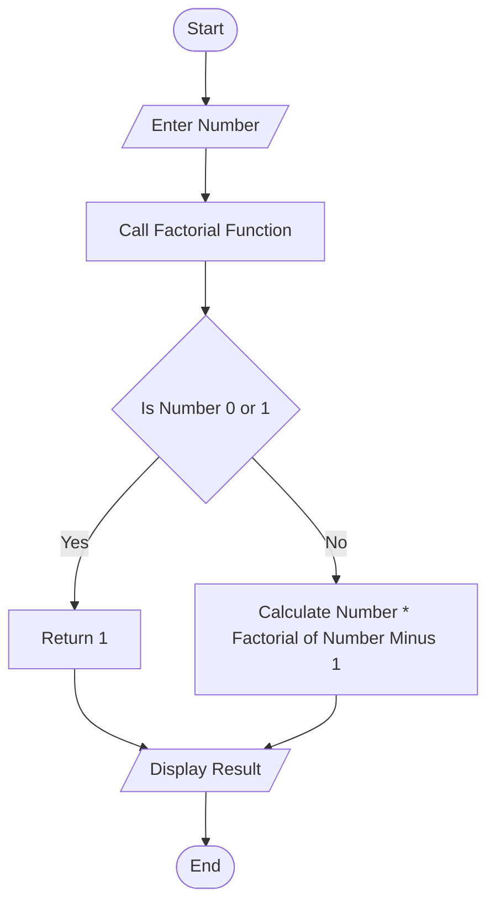
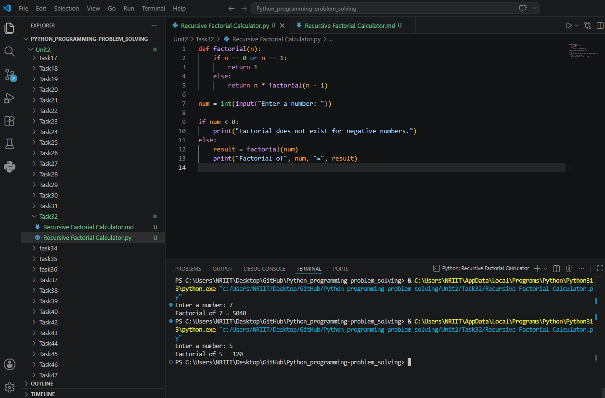

## Tutorial Task 32: Recursive Factorial Calculator

## 1. Problem Statement

Develop a Python program to calculate factorial using recursion.

## 2. Algorithm

1. Start the program.
2. Define a recursive function factorial(n).
3. Check if n is 0 or 1:
4. Return 1.
5. Otherwise:
6. Return n * factorial(n-1).
7. Input a number from the user.
8. Call the factorial function.
9. Display the factorial value.
10. End the program.

## 3. Flowchart


## 4. Python Source Code

```
def factorial(n):
    if n == 0 or n == 1:
        return 1
    else:
        return n * factorial(n - 1)

num = int(input("Enter a number: "))

if num < 0:
    print("Factorial does not exist for negative numbers.")
else:
    result = factorial(num)
    print("Factorial of", num, "=", result)
```

## 5. Sample Input/Output

```
Sample Run 1

Enter a number: 5
Factorial of 5 = 120

Sample Run 2

Enter a number: 7
Factorial of 7 = 5040
```

## 6. Screenshots

