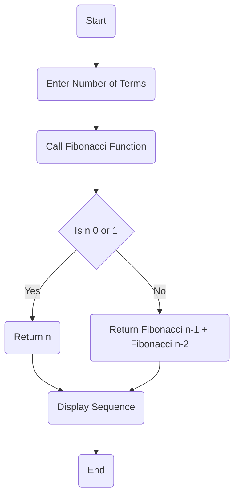
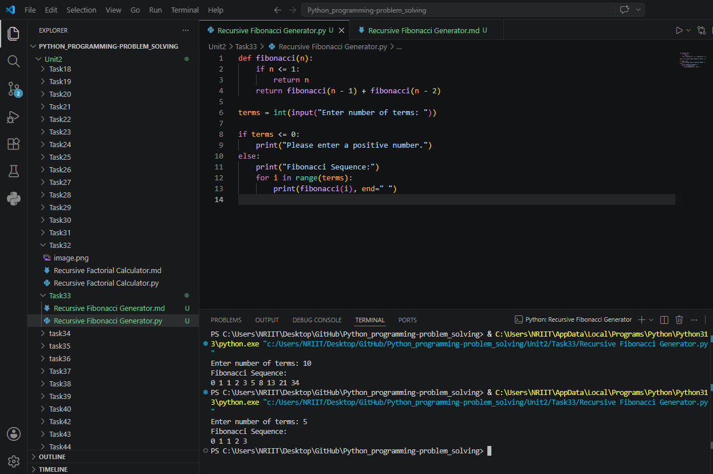

## Tutorial Task 33: Recursive Fibonacci Generator

## 1. Problem Statement

Develop a Python program to generate Fibonacci numbers using 
recursion.

## 2. Algorithm

1. Start the program.
2. Define a recursive function fibonacci(n).
3. If n is 0, return 0.
4. If n is 1, return 1.
5. Otherwise, return fibonacci(n-1) + fibonacci(n-2).
6. Input the number of terms.
7. Use a loop to call the recursive function for each term.
8. Display the Fibonacci sequence.
9. End the program.

## 3. Flowchart


## 4. Python Source Code

```
def fibonacci(n):
    if n <= 1:
        return n
    return fibonacci(n - 1) + fibonacci(n - 2)

terms = int(input("Enter number of terms: "))

if terms <= 0:
    print("Please enter a positive number.")
else:
    print("Fibonacci Sequence:")
    for i in range(terms):
        print(fibonacci(i), end=" ")
```

## 5. Sample Input/Output

```
Sample Run 1

Enter number of terms: 5
Fibonacci Sequence:
0 1 1 2 3

Sample Run 2

Enter number of terms: 8
Fibonacci Sequence:
0 1 1 2 3 5 8 13

Sample Run 3

Enter number of terms: 10
Fibonacci Sequence:
0 1 1 2 3 5 8 13 21 34
```

## 6. Screenshots

