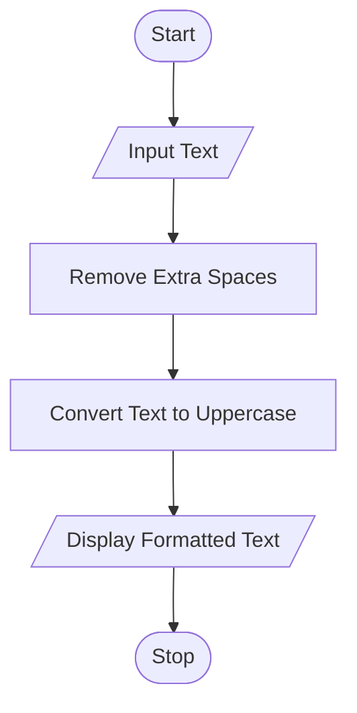

# Tutorial Task 37: Text Formatter

## 1. Problem Statement

Develop a Python program to format text by converting case, aligning content, and removing extra spaces.

---

## 2. Algorithm

1. Start
2. Input Text
3. Remove Extra Spaces
4. Convert Text to Uppercase
5. Display Formatted Text
6. Stop

---

## 3. Flowchart

### Mermaid Flowchart Code (.md)



---

## 4. Python Source Code

```
text = input("Enter Text: ")

formatted_text = " ".join(text.split())
formatted_text = formatted_text.upper()

print("Formatted Text =", formatted_text)
```

---

## 5. Sample Input/Output

### Input

```text id="g6y4tr"
Enter Text:   hello   world   python
```

### Output

```text id="m9q2ws"
Formatted Text = HELLO WORLD PYTHON
```

### Screenshot

