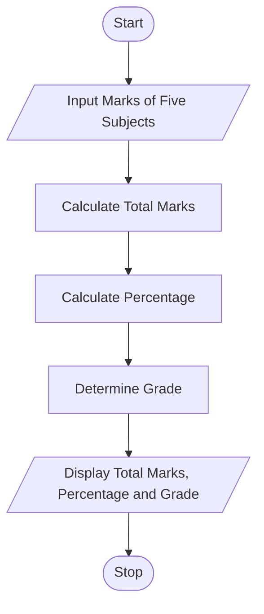

# Tutorial Task 38: Marks Analysis System

## 1. Problem Statement

Develop a Python program to analyze marks and generate performance reports.

---

## 2. Algorithm

1. Start
2. Input Marks of Five Subjects
3. Calculate Total Marks
4. Calculate Percentage
5. Determine Grade
6. Display Total Marks, Percentage, and Grade
7. Stop

---

## 3. Flowchart

### Mermaid Flowchart Code (.md)



---

## 4. Python Source Code

```python id="n5k8wd"
m1 = int(input("Enter Marks of Subject 1: "))
m2 = int(input("Enter Marks of Subject 2: "))
m3 = int(input("Enter Marks of Subject 3: "))
m4 = int(input("Enter Marks of Subject 4: "))
m5 = int(input("Enter Marks of Subject 5: "))

total = m1 + m2 + m3 + m4 + m5
percentage = total / 5

if percentage >= 90:
    grade = "A"
elif percentage >= 75:
    grade = "B"
elif percentage >= 50:
    grade = "C"
else:
    grade = "Fail"

print("Total Marks =", total)
print("Percentage =", percentage)
print("Grade =", grade)
```

---

## 5. Sample Input/Output

### Input

```text
Enter Marks of Subject 1: 85
Enter Marks of Subject 2: 90
Enter Marks of Subject 3: 80
Enter Marks of Subject 4: 88
Enter Marks of Subject 5: 92
```

### Output

```text
Total Marks = 435
Percentage = 87.0
Grade = B
```
### Screenshot

