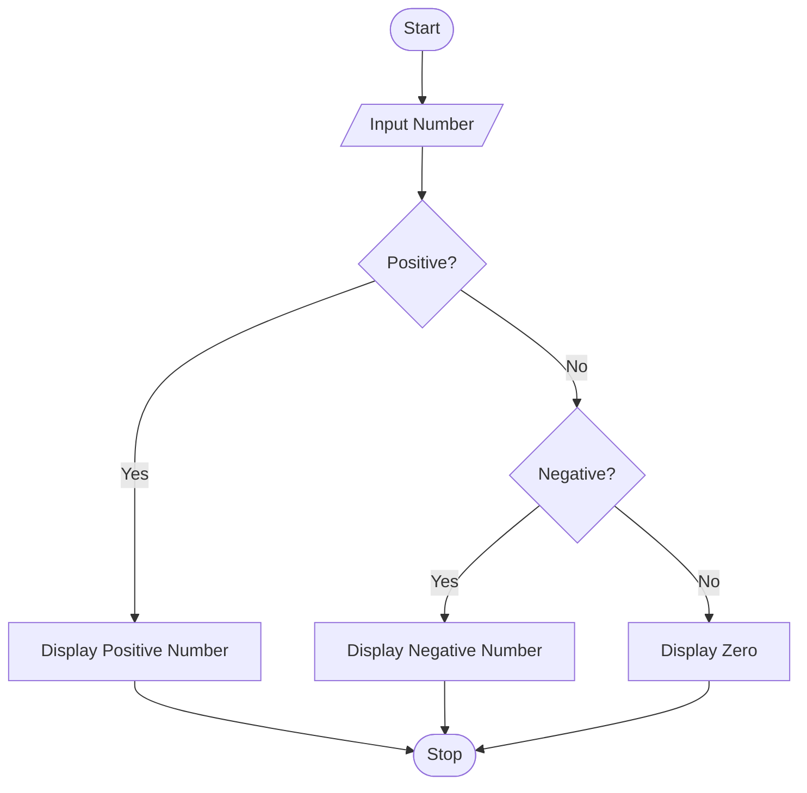

# Number Classifier Using Python

## 1. Problem Statement

Develop a Python program that accepts a number from the user and classifies it as:

* Positive Number
* Negative Number
* Zero

The program should use conditional statements to determine the category of the given number.

---

## 2. Algorithm

1. Start the program.
2. Read a number from the user.
3. Check if the number is greater than 0.
   * If true, display "Positive Number".
4. Otherwise, check if the number is less than 0.
   * If true, display "Negative Number".
5. Otherwise, display "Zero".
6. Stop the program.

---

## 3. Flowchart



## 4. Python Source Code

```python
# Program to classify a number as Positive, Negative, or Zero

num = int(input("Enter a number: "))

if num > 0:
    print("Positive Number")
elif num < 0:
    print("Negative Number")
else:
    print("Zero")
```

---

## 5. Sample Input/Output


