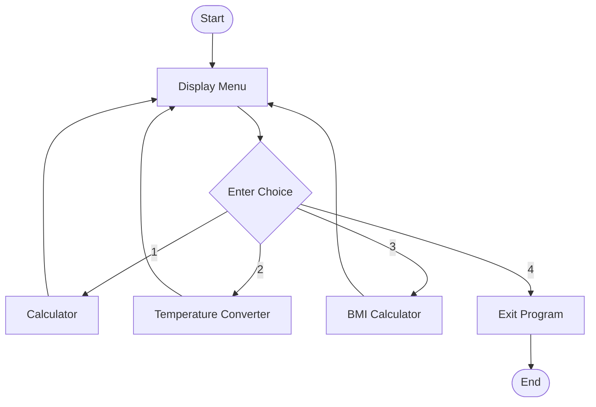
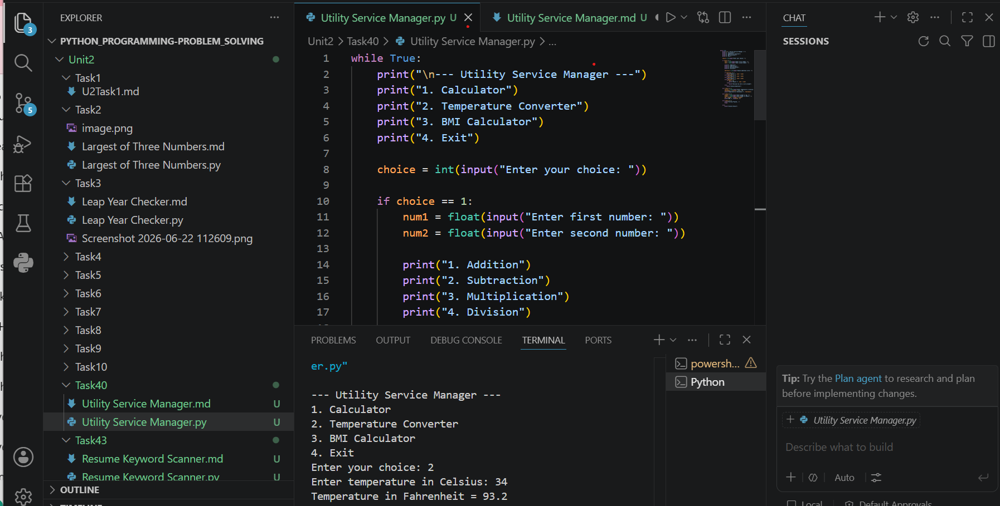

# Tutorial Task 40: Utility Service Manager

## 1. Problem Statement

Develop a Python program that provides multiple utility services through a menu-driven interface. The program should allow users to perform Calculator operations, Temperature Conversion, and BMI Calculation. The user can select any service from the menu and continue using the application until choosing the Exit option.

---

## 2. Algorithm

1. Start the program.
2. Display the Utility Service Manager menu.
3. Accept the user's choice.
4. If the choice is Calculator:

   * Input two numbers.
   * Select an arithmetic operation.
   * Display the result.
5. If the choice is Temperature Converter:

   * Input temperature in Celsius.
   * Convert it to Fahrenheit.
   * Display the result.
6. If the choice is BMI Calculator:

   * Input weight and height.
   * Calculate BMI.
   * Display the result.
7. If the choice is Exit:

   * Terminate the program.
8. Otherwise, display an error message.
9. Repeat the process until Exit is selected.
10. Stop.

---

## 3. Flowchart


# Flowchart




## 4. Python Source Code

```python
while True:
    print("\n--- Utility Service Manager ---")
    print("1. Calculator")
    print("2. Temperature Converter")
    print("3. BMI Calculator")
    print("4. Exit")

    choice = int(input("Enter your choice: "))

    if choice == 1:
        num1 = float(input("Enter first number: "))
        num2 = float(input("Enter second number: "))

        print("1. Addition")
        print("2. Subtraction")
        print("3. Multiplication")
        print("4. Division")

        operation = int(input("Choose operation (1-4): "))

        if operation == 1:
            print("Result =", num1 + num2)
        elif operation == 2:
            print("Result =", num1 - num2)
        elif operation == 3:
            print("Result =", num1 * num2)
        elif operation == 4:
            if num2 != 0:
                print("Result =", num1 / num2)
            else:
                print("Division by zero is not allowed")
        else:
            print("Invalid Operation")

    elif choice == 2:
        celsius = float(input("Enter temperature in Celsius: "))
        fahrenheit = (celsius * 9/5) + 32
        print("Temperature in Fahrenheit =", fahrenheit)

    elif choice == 3:
        weight = float(input("Enter weight in kg: "))
        height = float(input("Enter height in meters: "))
        bmi = weight / (height * height)
        print("BMI =", round(bmi, 2))

    elif choice == 4:
        print("Exiting Program...")
        break

    else:
        print("Invalid Choice")
```

---

## 5. Sample Input / Output

### Sample Run 1 (Calculator)

**Input**

1
10
20
1

**Output**

Result = 30.0

### Sample Run 2 (Temperature Converter)

**Input**

2
25

**Output**

Temperature in Fahrenheit = 77.0

### Sample Run 3 (BMI Calculator)

**Input**

3
60
1.65

**Output**

BMI = 22.04

## 6. Screenshots

Take and upload the following screenshots:

### Screenshot 1: Main Menu

--- Utility Service Manager ---
1. Calculator
2. Temperature Converter
3. BMI Calculator
4. Exit

### Screenshot 2: Calculator Output

Enter first number: 10
Enter second number: 20
Choose operation: 1
Result = 30.0

### Screenshot 3: Temperature Converter Output

Enter temperature in Celsius: 25
Temperature in Fahrenheit = 77.0

### Screenshot 4: BMI Calculator Output

Enter weight in kg: 60
Enter height in meters: 1.65
BMI = 22.04

### Screenshot 5: Exit Output

Enter your choice: 4
Exiting Program...
