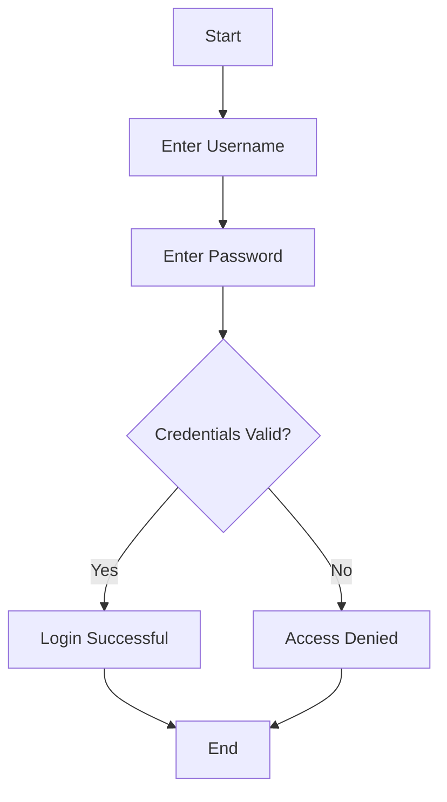
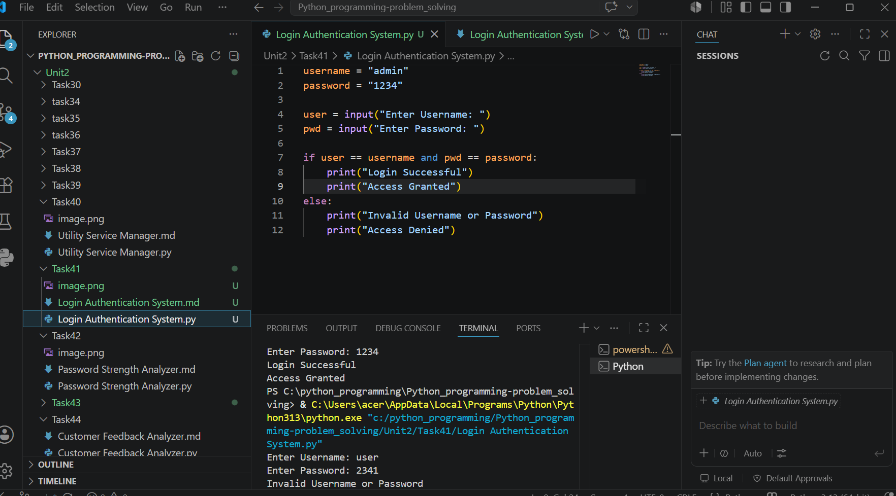

# Tutorial Task 41: Login Authentication System

## 1. Problem Statement

Develop a Python-based authentication system that validates user credentials and controls system access. The program should allow users to enter a username and password, verify the credentials against predefined values, and grant or deny access accordingly.

---

## 2. Algorithm

1. Start the program.
2. Define a valid username and password.
3. Accept username and password from the user.
4. Compare entered credentials with stored credentials.
5. If both credentials match:

   * Display "Login Successful".
   * Grant access.
6. Otherwise:

   * Display "Invalid Username or Password".
   * Deny access.
7. Stop the program.

---

## 3. Flowchart
## Flowchart



## 4. Python Source Code

```python
username = "admin"
password = "1234"

user = input("Enter Username: ")
pwd = input("Enter Password: ")

if user == username and pwd == password:
    print("Login Successful")
    print("Access Granted")
else:
    print("Invalid Username or Password")
    print("Access Denied")
```

---

## 5. Sample Input / Output

### Sample Input 1

```text
Enter Username: admin
Enter Password: 1234
```

### Sample Output 1

```text
Login Successful
Access Granted
```

---

### Sample Input 2

```text
Enter Username: user
Enter Password: 1111
```

### Sample Output 2

```text
Invalid Username or Password
Access Denied
```

---

## 6. Screenshots


### Screenshot 1: Successful Login

```text
Enter Username: admin
Enter Password: 1234

Login Successful
Access Granted
```


