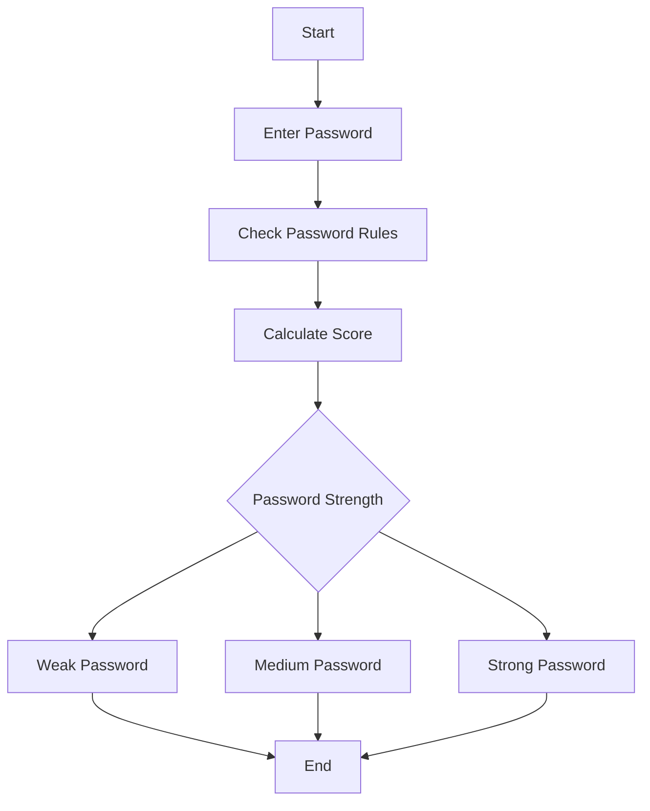
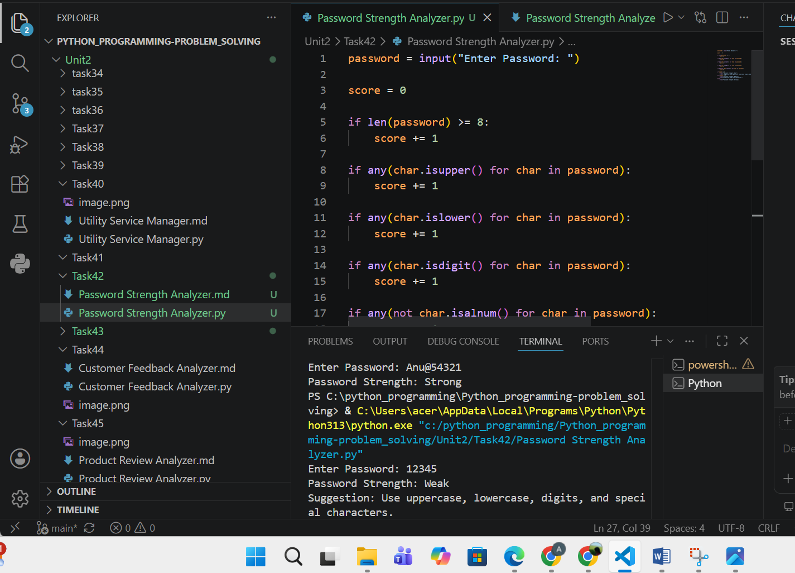

# Tutorial Task 42: Password Strength Analyzer

## 1. Problem Statement

Develop a Python application to evaluate password strength and recommend security improvements. The program should analyze a password based on length, uppercase letters, lowercase letters, digits, and special characters, then classify it as Weak, Medium, or Strong.

---

## 2. Algorithm

1. Start the program.
2. Input a password from the user.
3. Initialize score = 0.
4. Check if password length is at least 8 characters.
5. Check for uppercase letters.
6. Check for lowercase letters.
7. Check for digits.
8. Check for special characters.
9. Increase score for each satisfied condition.
10. Determine password strength:

    * Score ≤ 2 → Weak
    * Score 3 or 4 → Medium
    * Score 5 → Strong
11. Display password strength and suggestions.
12. Stop the program.

---

## 3. Flowchart (README.md)




## 4. Python Source Code

```python
password = input("Enter Password: ")

score = 0

if len(password) >= 8:
    score += 1

if any(char.isupper() for char in password):
    score += 1

if any(char.islower() for char in password):
    score += 1

if any(char.isdigit() for char in password):
    score += 1

if any(not char.isalnum() for char in password):
    score += 1

if score <= 2:
    print("Password Strength: Weak")
    print("Suggestion: Use uppercase, lowercase, digits, and special characters.")
elif score <= 4:
    print("Password Strength: Medium")
    print("Suggestion: Add more complexity.")
else:
    print("Password Strength: Strong")
```

---

## 5. Sample Input / Output

### Sample Input 1

```text
abc123
```

### Sample Output 1

```text
Password Strength: Weak
Suggestion: Use uppercase, lowercase, digits, and special characters.
```

---

### Sample Input 2

```text
Password123
```

### Sample Output 2

```text
Password Strength: Medium
Suggestion: Add more complexity.
```

---

### Sample Input 3

```text
Password@123
```

### Sample Output 3

```text
Password Strength: Strong
```

---

## 6. Screenshots


### Screenshot 1: Weak Password

```text
Enter Password: abc123
Password Strength: Weak
```

### Screenshot 2: Medium Password

```text
Enter Password: Password123
Password Strength: Medium
```

### Screenshot 3: Strong Password

```text
Enter Password: Password@123
Password Strength: Strong
```

