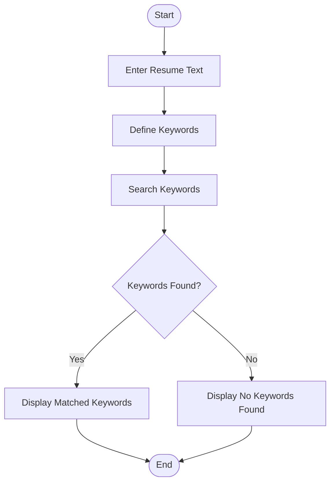
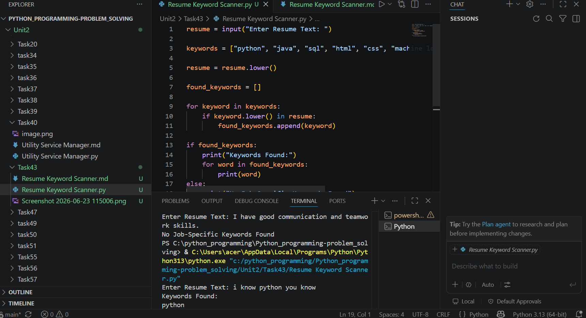

# Tutorial Task 43: Resume Keyword Scanner

## 1. Problem Statement

Develop a Python application that scans resumes and identifies job-specific keywords. The program should accept resume text from the user, search for predefined keywords related to a job role, and display the matching keywords found in the resume.

## 2. Algorithm

1. Start the program.
2. Input the resume text from the user.
3. Define a list of job-specific keywords.
4. Convert the resume text to lowercase.
5. Compare each keyword with the resume text.
6. Store matched keywords in a list.
7. Display the matched keywords.
8. If no keywords are found, display a suitable message.
9. Stop the program.

## 3. Flowchart (README.md)

## 4. Python Source Code

resume = input("Enter Resume Text: ")

keywords = ["python", "java", "sql", "html", "css", "machine learning", "data analysis"]

resume = resume.lower()

found_keywords = []

for keyword in keywords:
    if keyword.lower() in resume:
        found_keywords.append(keyword)

if found_keywords:
    print("Keywords Found:")
    for word in found_keywords:
        print(word)
else:
    print("No Job-Specific Keywords Found")

## 5. Sample Input / Output

### Sample Input

I have skills in Python, Java, SQL and Machine Learning.

### Sample Output

Keywords Found:
python
java
sql
machine learning

### Sample Input

I have good communication and teamwork skills.

### Sample Output

No Job-Specific Keywords Found

## 6. Screenshots

### Screenshot 1: Program Execution

Enter Resume Text:
I have skills in Python, Java, SQL and Machine Learning.

Keywords Found:
python
java
sql
machine learning

### Screenshot 2: No Keywords Found

Enter Resume Text:
I have good communication skills.

