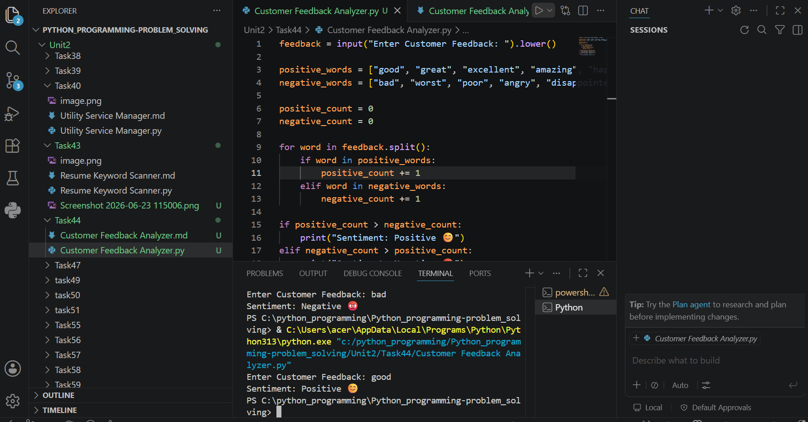

# Tutorial Task 44: Customer Feedback Analyzer

## 1. Problem Statement

Develop a Python application to analyze customer feedback and categorize responses based on sentiment such as **Positive, Negative, or Neutral**. The program should accept feedback from the user, analyze keywords, and display the sentiment result.


## 2. Algorithm

1. Start the program.
2. Input customer feedback from the user.
3. Convert feedback text to lowercase.
4. Define positive and negative keyword lists.
5. Check each word in feedback for matches.
6. Count positive and negative words.
7. Compare counts:

   * Positive > Negative → Positive Sentiment
   * Negative > Positive → Negative Sentiment
   * Else → Neutral Sentiment
8. Display the result.
9. Stop.

## 3. Flowchart (README.md)


   ```mermaid
flowchart TD
    A([Start])
    B[Enter Customer Feedback]
    C[Convert to Lowercase]
    D[Define Positive & Negative Keywords]
    E[Count Keyword Matches]
    F{Sentiment Analysis}
    G[Positive Sentiment]
    H[Negative Sentiment]
    I[Neutral Sentiment]
    J([End])

    A --> B
    B --> C
    C --> D
    D --> E
    E --> F

    F -->|Positive > Negative| G
    F -->|Negative > Positive| H
    F -->|Equal| I

    G --> J
    H --> J
    I --> J
``` 

## 4. Python Source Code

feedback = input("Enter Customer Feedback: ").lower()

positive_words = ["good", "great", "excellent", "amazing", "happy", "satisfied", "love"]
negative_words = ["bad", "worst", "poor", "angry", "disappointed", "hate", "slow"]

positive_count = 0
negative_count = 0

for word in feedback.split():
    if word in positive_words:
        positive_count += 1
    elif word in negative_words:
        negative_count += 1

if positive_count > negative_count:
    print("Sentiment: Positive 😊")
elif negative_count > positive_count:
    print("Sentiment: Negative 😡")
else:
    print("Sentiment: Neutral 😐")

## 5. Sample Input / Output

### Example 1

**Input:**

I am very happy and satisfied with your service

**Output:**

Sentiment: Positive 😊

### Example 2

**Input:**

The service is bad and I am disappointed

**Output:**

Sentiment: Negative 😡

### Example 3

**Input:**

The product is okay

**Output:**

Sentiment: Neutral 😐

## 6. Screenshots

