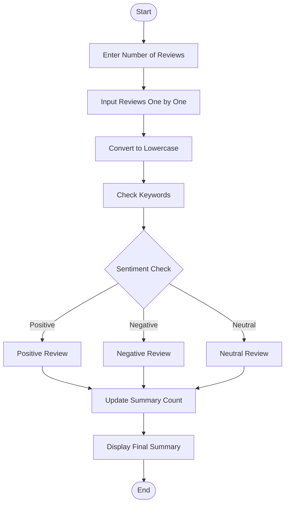
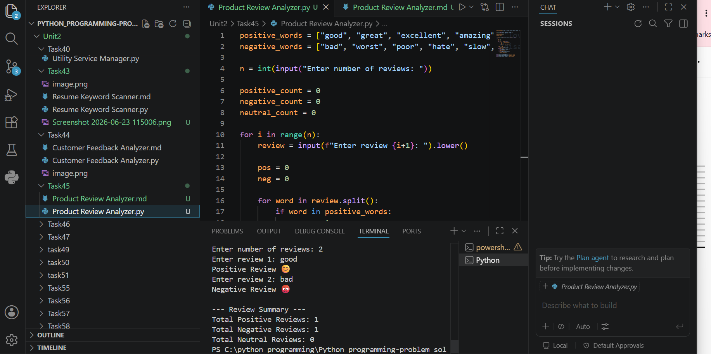

# Tutorial Task 45: Product Review Analyzer

## 1. Problem Statement
Develop a Python application to process product reviews and generate review summaries. The program should accept multiple product reviews, analyze them, and classify them as positive, negative, or neutral, then display a summary report.

---

## 2. Algorithm
1. Start the program.  
2. Input number of reviews from the user.  
3. Accept each review one by one.  
4. Convert reviews to lowercase.  
5. Define positive and negative keywords.  
6. For each review:
   - Count positive words  
   - Count negative words  
   - Classify sentiment  
7. Maintain total counts of positive, negative, neutral reviews.  
8. Display final summary report.  
9. Stop the program.  

---

## 3. Flowchart



---

## 4. Python Source Code

```python
positive_words = ["good", "great", "excellent", "amazing", "love", "nice", "satisfied"]
negative_words = ["bad", "worst", "poor", "hate", "slow", "disappointed", "terrible"]

n = int(input("Enter number of reviews: "))

positive_count = 0
negative_count = 0
neutral_count = 0

for i in range(n):
    review = input(f"Enter review {i+1}: ").lower()

    pos = 0
    neg = 0

    for word in review.split():
        if word in positive_words:
            pos += 1
        elif word in negative_words:
            neg += 1

    if pos > neg:
        print("Positive Review 😊")
        positive_count += 1
    elif neg > pos:
        print("Negative Review 😡")
        negative_count += 1
    else:
        print("Neutral Review 😐")
        neutral_count += 1

print("\n--- Review Summary ---")
print("Total Positive Reviews:", positive_count)
print("Total Negative Reviews:", negative_count)
print("Total Neutral Reviews:", neutral_count)
```

---

## 5. Sample Input / Output

### Input
```text
Enter number of reviews: 3
Enter review 1: This product is good and amazing
Enter review 2: Very bad and poor quality
Enter review 3: It is okay product
```

### Output
```text
Positive Review 😊
Negative Review 😡
Neutral Review 😐

--- Review Summary ---
Total Positive Reviews: 1
Total Negative Reviews: 1
Total Neutral Reviews: 1
```

---

## 6. Screenshots

