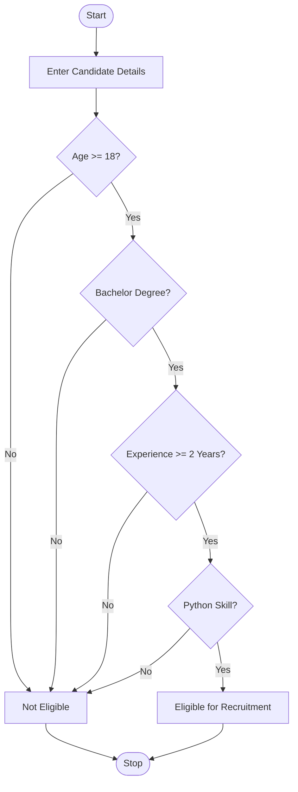
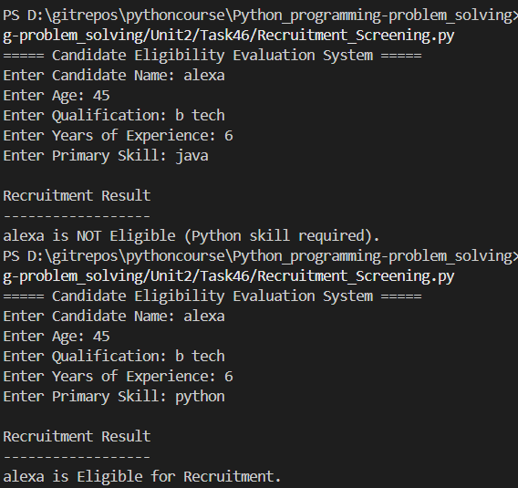

# Candidate Eligibility Evaluation System Using Python

## 1. Problem Statement

Develop a Python application to evaluate candidate eligibility based on predefined recruitment criteria.

The application should:

* Accept candidate details.
* Check eligibility based on recruitment requirements.
* Generate a recruitment decision.
* Use control structures, strings, and functions.

### Recruitment Criteria

* Minimum Age: 18 years
* Minimum Qualification: Bachelor's Degree
* Minimum Experience: 2 years
* Required Skill: Python

---

## 2. Algorithm

1. Start the program.
2. Input candidate name.
3. Input age.
4. Input qualification.
5. Input years of experience.
6. Input primary skill.
7. Check whether:

   * Age ≥ 18
   * Qualification = Bachelor's Degree
   * Experience ≥ 2 years
   * Skill = Python
8. If all conditions are satisfied:

   * Display "Eligible for Recruitment".
9. Otherwise:

   * Display "Not Eligible for Recruitment".
10. Stop the program.

---

## 3. Flowchart



---

## 4. Python Source Code

```python

def check_eligibility(name, age, qualification, experience, skill):
    qualification = qualification.lower()
    skill = skill.lower()
    if age < 18:
        return f"{name} is NOT Eligible (Age below 18)."
    if qualification not in ["bachelor", "bachelor's degree", "bachelors","b tech"]:
        return f"{name} is NOT Eligible (Bachelor's Degree required)."
    if experience < 2:
        return f"{name} is NOT Eligible (Minimum 2 years experience required)."
    if skill != "python":
        return f"{name} is NOT Eligible (Python skill required)."
    return f"{name} is Eligible for Recruitment."

def main():
    print("===== Candidate Eligibility Evaluation System =====")
    name = input("Enter Candidate Name: ")
    age = int(input("Enter Age: "))
    qualification = input("Enter Qualification: ")
    experience = float(input("Enter Years of Experience: "))
    skill = input("Enter Primary Skill: ")
    result = check_eligibility(name,age,qualification,experience,skill)
    print("\nRecruitment Result")
    print("------------------")
    print(result)

main()
```

---

## 5. Sample Input/Output

### Example 1

**Input**

```text
Enter Candidate Name: Rahul
Enter Age: 24
Enter Qualification: Bachelor's Degree
Enter Years of Experience: 3
Enter Primary Skill: Python
```

**Output**

```text
Recruitment Result
------------------
Rahul is Eligible for Recruitment.
```

---

### Example 2

**Input**

```text
Enter Candidate Name: Priya
Enter Age: 20
Enter Qualification: Diploma
Enter Years of Experience: 3
Enter Primary Skill: Python
```

**Output**

```text
Recruitment Result
------------------
Priya is NOT Eligible (Bachelor's Degree required).
```

---

### Example 3

**Input**

```text
Enter Candidate Name: Kiran
Enter Age: 22
Enter Qualification: Bachelor's Degree
Enter Years of Experience: 1
Enter Primary Skill: Java
```

**Output**

```text
Recruitment Result
------------------
Kiran is NOT Eligible (Minimum 2 years experience required).
```
```
## 6. Screenshots
