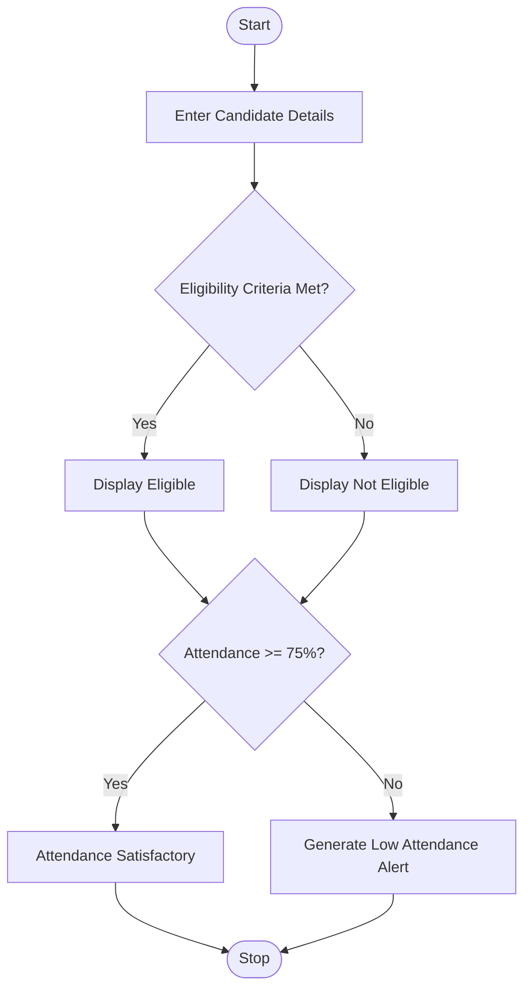
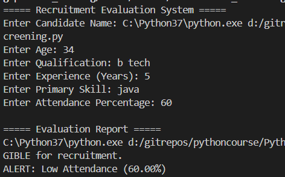

# Candidate Eligibility and Attendance Alert System Using Python

## 1. Problem Statement

Develop a Python application to evaluate candidate eligibility based on predefined recruitment criteria and generate alerts for low attendance.

### Recruitment Criteria

* Age must be 18 years or above.
* Qualification must be Bachelor's Degree.
* Experience must be at least 2 years.
* Required skill: Python.
* Attendance must be 75% or above.

The application should use:

* Functions
* Strings
* Control Structures (if-else)

---

## 2. Algorithm

1. Start the program.
2. Input candidate details:

   * Name
   * Age
   * Qualification
   * Experience
   * Skill
   * Attendance Percentage
3. Check recruitment eligibility:

   * Age ≥ 18
   * Qualification = Bachelor's Degree
   * Experience ≥ 2 years
   * Skill = Python
4. If all conditions are satisfied:

   * Candidate is Eligible.
5. Otherwise:

   * Candidate is Not Eligible.
6. Check attendance:

   * If attendance < 75%

     * Generate Low Attendance Alert.
   * Else

     * Attendance Satisfactory.
7. Display results.
8. Stop the program.

---

## 3. Flowchart



---

## 4. Python Source Code

```python
def check_eligibility(age, qualification, experience, skill):
    qualification = qualification.lower()
    skill = skill.lower()
    if age >= 18 and qualification in ["bachelor", "bachelor's degree", "bachelors"] and \
       experience >= 2 and skill == "python":
        return True
    else:
        return False

def attendance_alert(attendance):
    if attendance < 75:
        return f"ALERT: Low Attendance ({attendance:.2f}%)"
    else:
        return f"Attendance Satisfactory ({attendance:.2f}%)"

def main():
    print("===== Recruitment Evaluation System =====")
    name = input("Enter Candidate Name: ")
    age = int(input("Enter Age: "))
    qualification = input("Enter Qualification: ")
    experience = float(input("Enter Experience (Years): "))
    skill = input("Enter Primary Skill: ")
    attendance = float(input("Enter Attendance Percentage: "))
    eligible = check_eligibility( age, qualification, experience, skill)
    print("\n===== Evaluation Report =====")
    if eligible:
        print(f"{name} is ELIGIBLE for recruitment.")
    else:
        print(f"{name} is NOT ELIGIBLE for recruitment.")
    print(attendance_alert(attendance))
main()
```

---

## 5. Sample Input/Output

### Example 1

**Input**

```text
Enter Candidate Name: Rahul
Enter Age: 24
Enter Qualification: Bachelor's Degree
Enter Experience (Years): 3
Enter Primary Skill: Python
Enter Attendance Percentage: 85
```

**Output**

```text
===== Evaluation Report =====
Rahul is ELIGIBLE for recruitment.
Attendance Satisfactory (85.00%)
```

---

### Example 2

**Input**

```text
Enter Candidate Name: Priya
Enter Age: 21
Enter Qualification: Bachelor's Degree
Enter Experience (Years): 2
Enter Primary Skill: Python
Enter Attendance Percentage: 60
```

**Output**

```text
===== Evaluation Report =====
Priya is ELIGIBLE for recruitment.
ALERT: Low Attendance (60.00%)
```

---

### Example 3

**Input**

```text
Enter Candidate Name: Kiran
Enter Age: 17
Enter Qualification: Bachelor's Degree
Enter Experience (Years): 1
Enter Primary Skill: Java
Enter Attendance Percentage: 80
```

**Output**

```text
===== Evaluation Report =====
Kiran is NOT ELIGIBLE for recruitment.
Attendance Satisfactory (80.00%)
```

---

## 6. Screenshots
