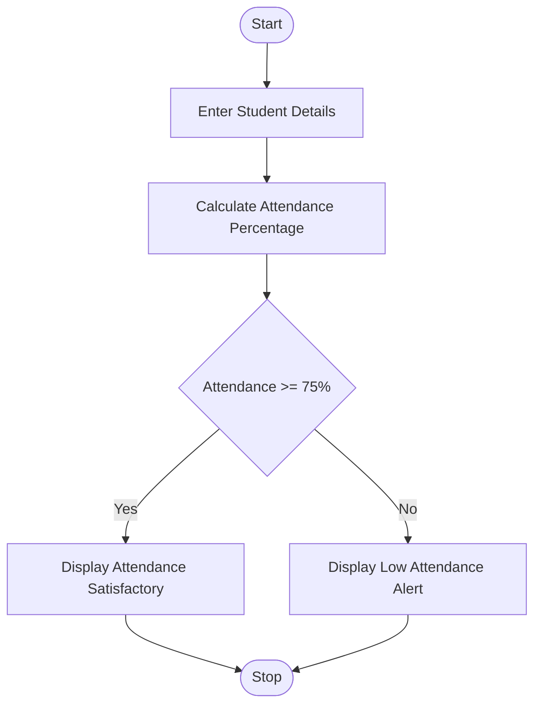
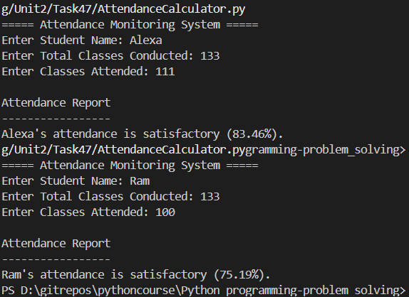

# Attendance Monitoring and Alert System Using Python

## 1. Problem Statement

Develop a Python application that monitors student attendance and generates alerts for low attendance.

The system should:

* Accept student details.
* Calculate attendance percentage.
* Generate an alert if attendance is below 75%.
* Use control structures, strings, and functions.

---

## 2. Algorithm

1. Start the program.

2. Input student name.

3. Input total classes conducted.

4. Input classes attended.

5. Calculate attendance percentage.

   attendance_percentage = (classes_attended / total_classes) × 100

6. If attendance percentage is less than 75:

   * Display "Low Attendance Alert".

7. Otherwise:

   * Display "Attendance Satisfactory".

8. Stop the program.

---

## 3. Flowchart



---

## 4. Python Source Code

```python

def calculate_attendance(total_classes, attended_classes):
    return (attended_classes / total_classes) * 100


def generate_alert(name, percentage):
    if percentage < 75:
        return f"ALERT: {name}'s attendance is low ({percentage:.2f}%)."
    else:
        return f"{name}'s attendance is satisfactory ({percentage:.2f}%)."


def main():
    print("===== Attendance Monitoring System =====")
    name = input("Enter Student Name: ")
    total_classes = int(input("Enter Total Classes Conducted: "))
    attended_classes = int(input("Enter Classes Attended: "))
    percentage = calculate_attendance(total_classes,attended_classes )
    result = generate_alert(name, percentage)
    print("\nAttendance Report")
    print("-----------------")
    print(result)


main()
```

---

## 5. Sample Input/Output

### Example 1

**Input**

```text
Enter Student Name: Rahul
Enter Total Classes Conducted: 100
Enter Classes Attended: 85
```

**Output**

```text
Attendance Report
-----------------
Rahul's attendance is satisfactory (85.00%).
```

---

### Example 2

**Input**

```text
Enter Student Name: Priya
Enter Total Classes Conducted: 100
Enter Classes Attended: 60
```

**Output**

```text
Attendance Report
-----------------
ALERT: Priya's attendance is low (60.00%).
```

---

## 6. Screenshots
