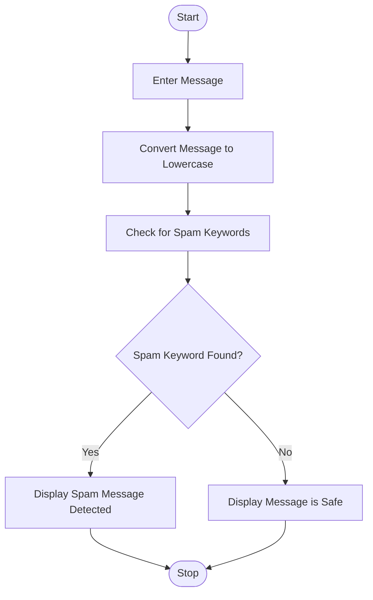
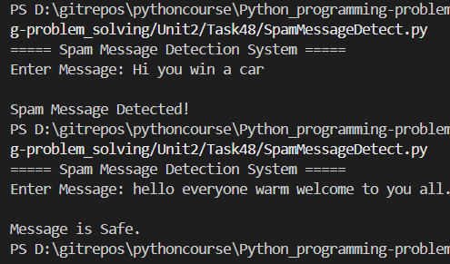

# Spam Message Detection Using Python

## 1. Problem Statement

Develop a Python application to identify spam messages using keyword-based filtering techniques.

The application should analyze a user-entered message and determine whether it is spam based on the presence of predefined spam keywords.

### Spam Keywords

* free
* win
* winner
* prize
* lottery
* urgent
* claim
* offer
* money
* congratulations

If any of these keywords are found in the message, it will be classified as **Spam**; otherwise, it will be classified as **Not Spam**.

---

## 2. Algorithm

1. Start the program.
2. Define a list of spam keywords.
3. Read a message from the user.
4. Convert the message to lowercase.
5. Check whether any spam keyword exists in the message.
6. If a spam keyword is found:

   * Display "Spam Message Detected".
7. Otherwise:

   * Display "Message is Safe".
8. Stop the program.

---

## 3. Flowchart



---

## 4. Python Source Code

```python
def is_spam(message):
    spam_keywords = [ "free", "win","winner","prize","lottery","urgent","claim","offer","money",
        "congratulations"]
    message = message.lower()
    for keyword in spam_keywords:
        if keyword in message:
            return True
    return False

def display_result(message):
    if is_spam(message):
        print("\nSpam Message Detected!")
    else:
        print("\nMessage is Safe.")

def main():
    print("===== Spam Message Detection System =====")
    user_message = input("Enter Message: ")
    display_result(user_message)
main()
```

---

## 5. Sample Input/Output

### Example 1

**Input**

```text
Enter Message: Congratulations! You have won a free prize.
```

**Output**

```text
Spam Message Detected!
```

---

### Example 2

**Input**

```text
Enter Message: Meeting is scheduled at 10 AM tomorrow.
```

**Output**

```text
Message is Safe.
```

---

### Example 3

**Input**

```text
Enter Message: Urgent! Claim your lottery money now.
```

**Output**

```text
Spam Message Detected!
```

---

## 6. Screenshots
