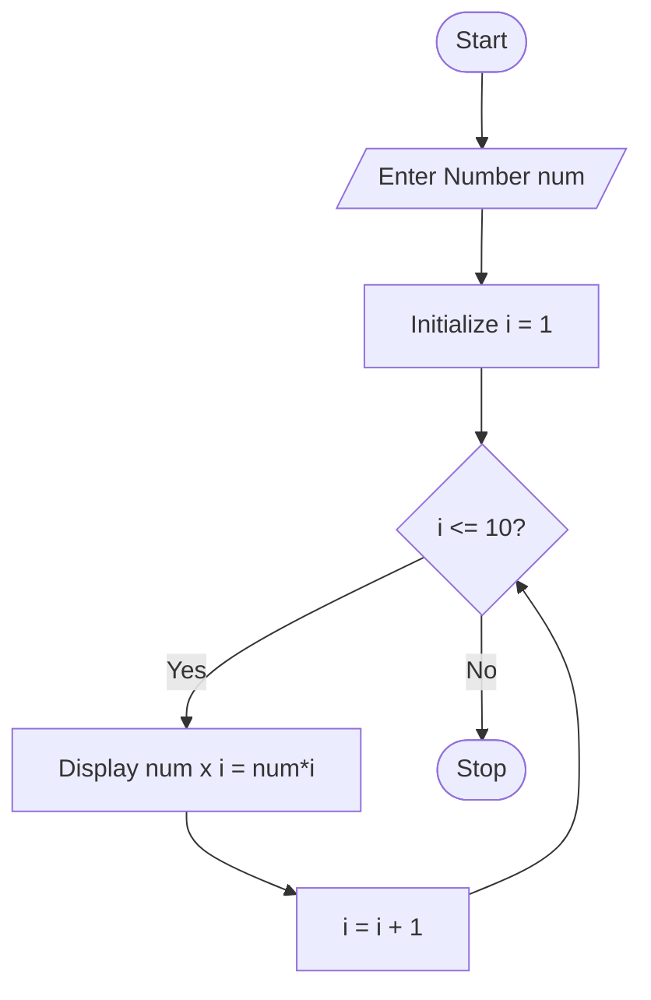

# Multiplication Table Generator Using Python

## 1. Problem Statement

Develop a Python program to generate the multiplication table for a given number. The program should accept a number from the user and display its multiplication table from 1 to 10.

---

## 2. Algorithm

1. Start the program.
2. Input a number `n`.
3. Initialize a counter `i = 1`.
4. Repeat while `i <= 10`:

   * Calculate `n × i`.
   * Display the result.
   * Increment `i` by 1.
5. Stop the program.

---
## 3. Flowchart




## 4. Python Source Code

```python
# Program to generate multiplication table

num = int(input("Enter a number: "))

print(f"\nMultiplication Table of {num}\n")

for i in range(1, 11):
    print(f"{num} x {i} = {num * i}")
```

---

## 5. Sample Input/Output

### Input

```text
Enter a number: 5
```

### Output

```text
Multiplication Table of 5

5 x 1 = 5
5 x 2 = 10
5 x 3 = 15
5 x 4 = 20
5 x 5 = 25
5 x 6 = 30
5 x 7 = 35
5 x 8 = 40
5 x 9 = 45
5 x 10 = 50
```

---

## 6. Screenshots


