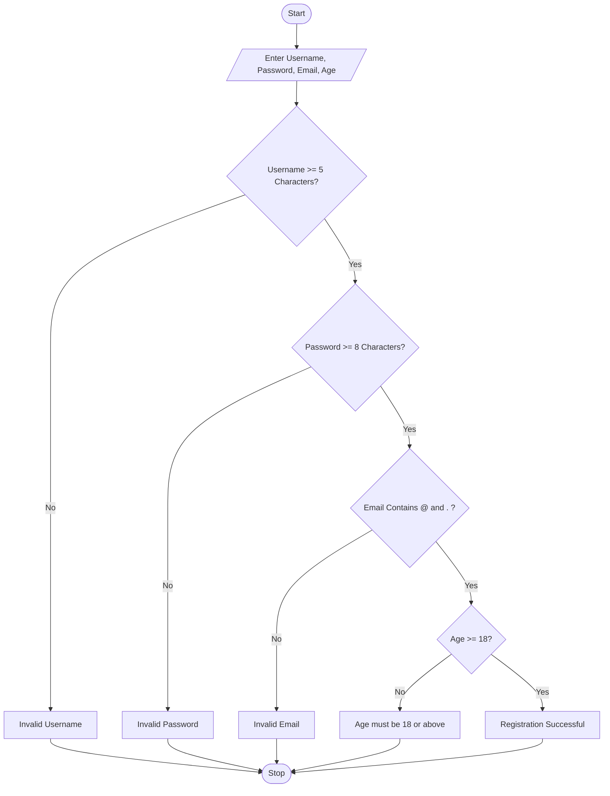
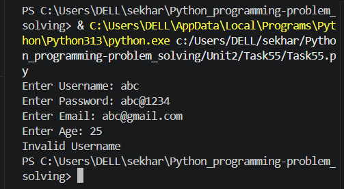
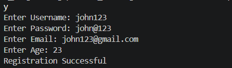

# User Registration Validator

## 1. Problem Statement

Develop a Python application to validate user registration information according to organizational policies. The application should verify whether the entered username, password, email address, and age satisfy the specified validation rules. If all conditions are met, the registration is successful; otherwise, appropriate error messages should be displayed.

### Validation Rules

* Username must contain at least 5 characters.
* Password must contain at least 8 characters.
* Email must contain both `@` and `.` symbols.
* Age must be 18 years or above.

---

## 2. Algorithm

1. Start
2. Read username, password, email, and age from the user.
3. Check whether the username length is at least 5.

   * If not, display **"Invalid Username"** and stop.
4. Check whether the password length is at least 8.

   * If not, display **"Invalid Password"** and stop.
5. Check whether the email contains `@` and `.`.

   * If not, display **"Invalid Email"** and stop.
6. Check whether the age is 18 or above.

   * If not, display **"Age must be 18 or above"** and stop.
7. Display **"Registration Successful"**.
8. Stop.

---

## 3. Flowchart



---

## 4. Python Source Code

```python
username = input("Enter Username: ")
password = input("Enter Password: ")
email = input("Enter Email: ")
age = int(input("Enter Age: "))

if len(username) < 5:
    print("Invalid Username")

elif len(password) < 8:
    print("Invalid Password")

elif "@" not in email or "." not in email:
    print("Invalid Email")

elif age < 18:
    print("Age must be 18 or above")

else:
    print("Registration Successful")
```

---

## 5. Sample Input/Output

### Sample Run 1 (Valid Registration)

**Input**

```text
Enter Username: john123
Enter Password: john@1234
Enter Email: john@gmail.com
Enter Age: 20
```

**Output**

```text
Registration Successful
```

### Sample Run 2 (Invalid Username)

**Input**

```text
Enter Username: abc
Enter Password: john@1234
Enter Email: john@gmail.com
Enter Age: 20
```

**Output**

```text
Invalid Username
```

### Sample Run 3 (Invalid Password)

**Input**

```text
Enter Username: john123
Enter Password: abc123
Enter Email: john@gmail.com
Enter Age: 20
```

**Output**

```text
Invalid Password
```

---

## 6. Screenshots



