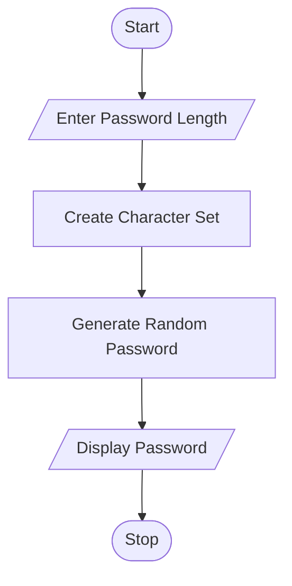
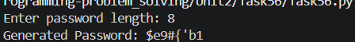

# Tutorial Task 28: Secure Password Generator

## 1. Problem Statement

Write a Python program to generate a secure password of user-specified length using uppercase letters, lowercase letters, digits, and special characters.

---

## 2. Algorithm

1. Start the program.
2. Import the `random` and `string` modules.
3. Read the desired password length from the user.
4. Create a character set containing:

   * Uppercase letters
   * Lowercase letters
   * Digits
   * Special characters
5. Generate a random password of the specified length.
6. Display the generated password.
7. Stop the program.

---

## 3. Flowchart (.md Code)




## 4. Python Source Code

```python
import random
import string

length = int(input("Enter password length: "))

characters = string.ascii_letters + string.digits + string.punctuation

password = ''.join(random.choice(characters) for i in range(length))

print("Generated Password:", password)
```

---

## 5. Sample Input / Output

### Input

```text
Enter password length: 12
```

### Output

```text
Generated Password: A@7k#P9!xQ2$
```

> Note: The generated password will be different each time because it is randomly created.

---

## 6. Screenshots

### Source Code Screenshot

```md

```

### Program Output Screenshot


-

