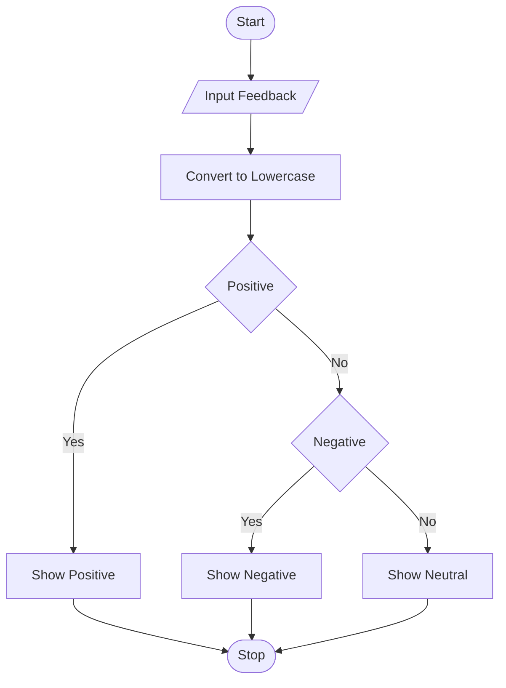
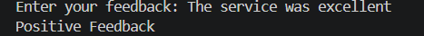
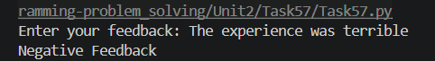
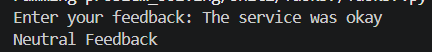

# Tutorial Task 29: Feedback Categorization Tool

## 1. Problem Statement

Write a Python program to categorize user feedback into different categories such as **Positive**, **Negative**, or **Neutral** based on the user's input.

---

## 2. Algorithm

1. Start the program.
2. Read feedback from the user.
3. Convert the feedback to lowercase.
4. Check whether the feedback contains positive keywords.
5. If yes, display **Positive Feedback**.
6. Otherwise, check whether the feedback contains negative keywords.
7. If yes, display **Negative Feedback**.
8. Otherwise, display **Neutral Feedback**.
9. Stop the program.

---

## 3. Flowchart (.md Code)



## 4. Python Source Code

```python
feedback = input("Enter your feedback: ").lower()

positive_words = ["good", "excellent", "great", "awesome", "happy"]
negative_words = ["bad", "poor", "worst", "terrible", "sad"]

if any(word in feedback for word in positive_words):
    print("Positive Feedback")
elif any(word in feedback for word in negative_words):
    print("Negative Feedback")
else:
    print("Neutral Feedback")
```

---

## 5. Sample Input / Output

### Input 1

```text
Enter your feedback: The service was excellent
```

### Output 1

```text
Positive Feedback
```

### Input 2

```text
Enter your feedback: The experience was terrible
```

### Output 2

```text
Negative Feedback
```

### Input 3

```text
Enter your feedback: The service was okay
```

### Output 3

```text
Neutral Feedback
```

---

## 6. Screenshots

### Source Code Screenshot


### Program Output Screenshot




