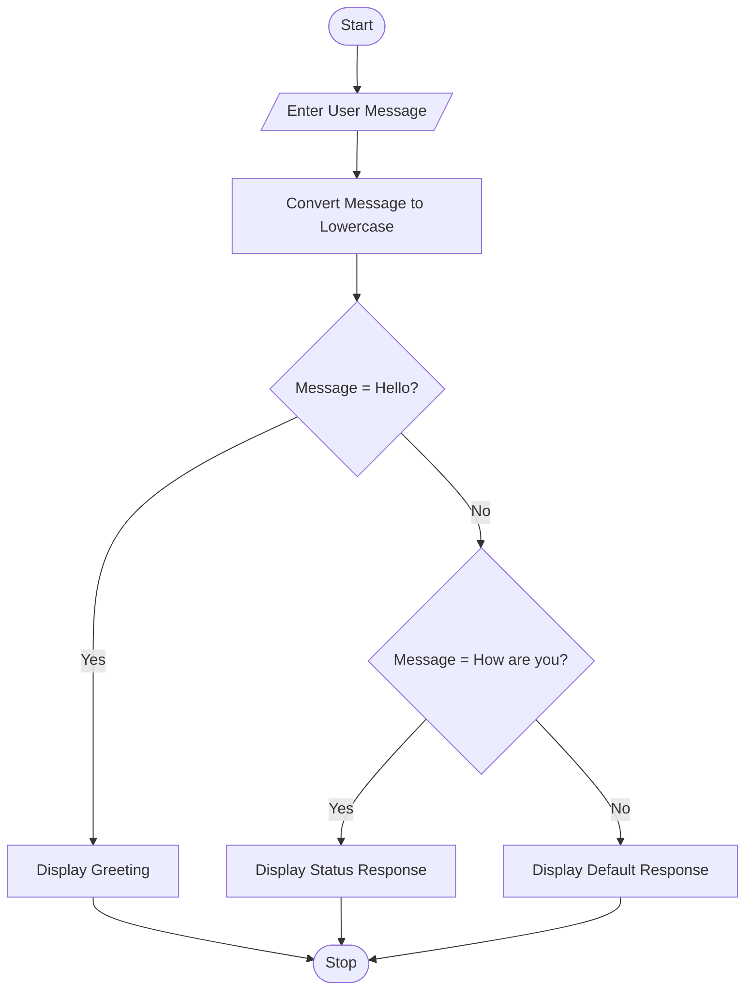
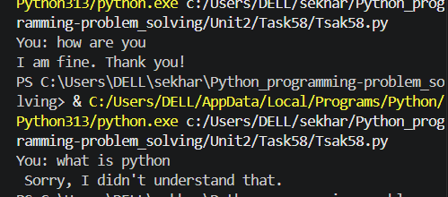

# Tutorial Task 30: Chatbot Input Processor

## 1. Problem Statement

Write a Python program that accepts user input and processes it like a simple chatbot. The chatbot should respond to common greetings and questions entered by the user.

---

## 2. Algorithm

1. Start the program.
2. Read user input.
3. Convert the input to lowercase.
4. Check the user message:

   * If it is "hello", display a greeting.
   * If it is "how are you", display a suitable response.
   * Otherwise, display a default message.
5. Stop the program.

---

## 3. Flowchart (.md Code)



## 4. Python Source Code

```python
message = input("You: ").lower()

if message == "hello":
    print("Bot: Hello! How can I help you?")
elif message == "how are you":
    print("Bot: I am fine. Thank you!")
else:
    print("Bot: Sorry, I didn't understand that.")
```

---

## 5. Sample Input / Output

### Input 1

```text
You: hello
```

### Output 1

```text
Bot: Hello! How can I help you?
```

### Input 2

```text
You: how are you
```

### Output 2

```text
Bot: I am fine. Thank you!
```

### Input 3

```text
You: what is python
```

### Output 3

```text
Bot: Sorry, I didn't understand that.
```

---

## 6. Screenshots

### Source Code Screenshot


### Program Output Screenshot


