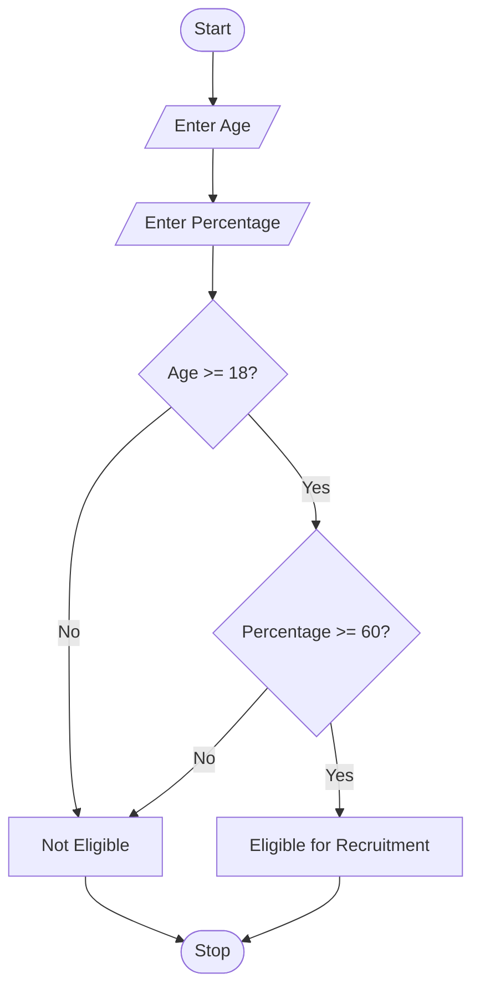
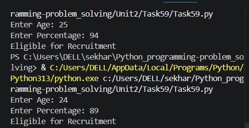

# Recruitment Eligibility Checker

## 1. Problem Statement

Write a Python program to check whether a candidate is eligible for recruitment based on age and percentage criteria.

**Eligibility Criteria:**

* Age should be **18 years or above**.
* Percentage should be **60% or above**.

---

## 2. Algorithm

1. Start the program.
2. Read candidate age.
3. Read candidate percentage.
4. Check whether age ≥ 18 and percentage ≥ 60.
5. If true, display **Eligible for Recruitment**.
6. Otherwise, display **Not Eligible for Recruitment**.
7. Stop the program.

---

## 3. Flowchart (.md Code)



---

## 4. Python Source Code

```python
age = int(input("Enter Age: "))
percentage = float(input("Enter Percentage: "))

if age >= 18 and percentage >= 60:
    print("Eligible for Recruitment")
else:
    print("Not Eligible for Recruitment")
```

---

## 5. Sample Input / Output

### Input 1

```text
Enter Age: 22
Enter Percentage: 75
```

### Output 1

```text
Eligible for Recruitment
```

### Input 2

```text
Enter Age: 17
Enter Percentage: 80
```

### Output 2

```text
Not Eligible for Recruitment
```

---

## 6. Screenshots


