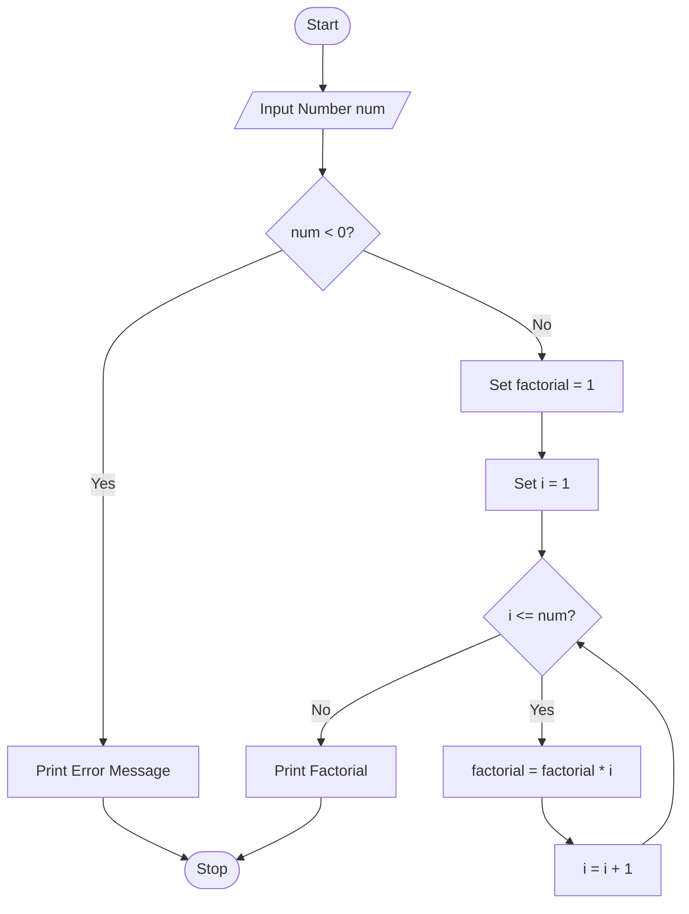

# Factorial of a Number Using Python

## 1. Problem Statement

Develop a Python program to calculate the factorial of a given number.

The factorial of a non-negative integer `n` is the product of all positive integers less than or equal to `n`.

**Formula:**

```text id="wwhww6"
n! = n × (n-1) × (n-2) × ... × 2 × 1
```

Examples:

```text id="9sy20k"
5! = 5 × 4 × 3 × 2 × 1 = 120
0! = 1
```

---

## 2. Algorithm

1. Start the program.
2. Read a number `n` from the user.
3. Initialize `factorial = 1`.
4. Check whether `n` is negative.

   * If yes, display an error message.
5. Otherwise, repeat from 1 to `n`:

   * Multiply `factorial` by the current value.
6. Display the factorial value.
7. Stop the program.

---

## 3. Flowchart



## 4. Python Source Code

```python 

num = int(input("Enter a number: "))

if num < 0:
    print("Factorial is not defined for negative numbers.")
else:
    factorial = 1

    for i in range(1, num + 1):
        factorial *= i

    print("Factorial of", num, "is", factorial)
```

---

## 5. Sample Input/Output

### Example 1

**Input**

```text id="83jq4l"
Enter a number: 5
```

**Output**

```text id="vb4d3m"
Factorial of 5 is 120
```

### Example 2

**Input**

```text id="7g8l0w"
Enter a number: 0
```

**Output**

```text id="v4z2iy"
Factorial of 0 is 1
```

### Example 3

**Input**

```text id="7hwsqd"
Enter a number: -4
```

**Output**

```text id="chuvn0"
Factorial is not defined for negative numbers.
```

---

## 6. Screenshots


