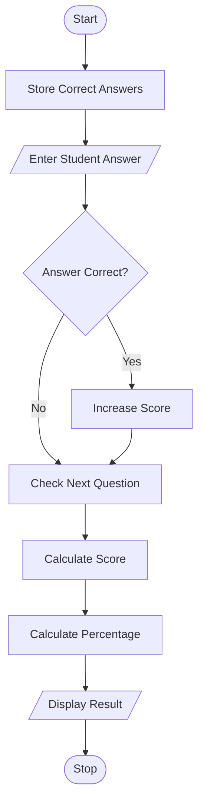
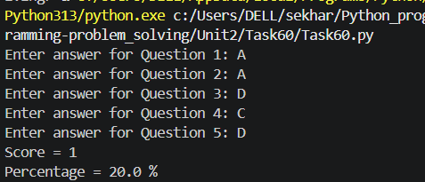

# Online Examination Validator

## 1. Problem Statement

Develop a Python application to validate examination responses and calculate assessment results. The program should compare the student's answers with the correct answers, calculate the score, and display the result.

---

## 2. Algorithm

1. Start the program.
2. Store the correct answers.
3. Read the student's answers.
4. Compare each student answer with the correct answer.
5. Increment the score for every correct answer.
6. Calculate the percentage.
7. Display the score and percentage.
8. Stop the program.

---

## 3. Flowchart (.md Code)


## 4. Python Source Code

```python
correct_answers = ["A", "B", "C", "D", "A"]

score = 0

for i in range(5):
    answer = input(f"Enter answer for Question {i+1}: ").upper()

    if answer == correct_answers[i]:
        score += 1

percentage = (score / len(correct_answers)) * 100

print("Score =", score)
print("Percentage =", percentage, "%")
```

---

## 5. Sample Input / Output

### Input

```text
Enter answer for Question 1: A
Enter answer for Question 2: B
Enter answer for Question 3: C
Enter answer for Question 4: A
Enter answer for Question 5: A
```

### Output

```text
Score = 4
Percentage = 80.0 %
```

---

## 6. Screenshots


