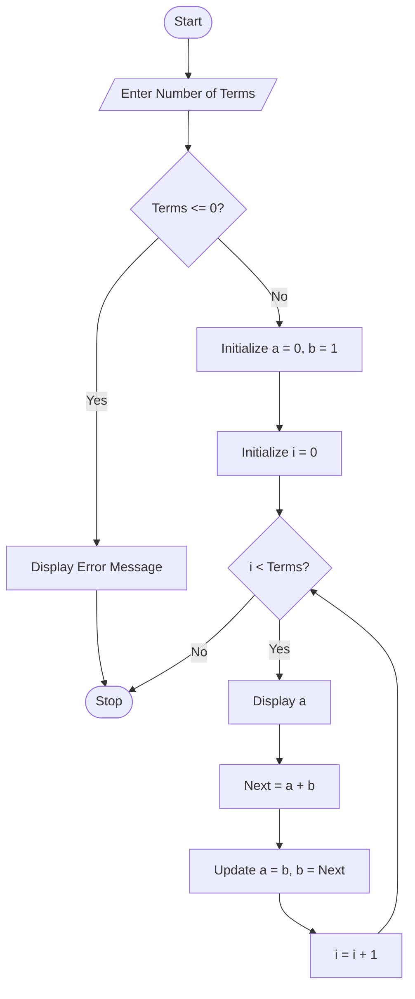

# Fibonacci Sequence Generator Using Python

## 1. Problem Statement

Develop a Python program to generate the Fibonacci sequence up to a specified number of terms.

The Fibonacci sequence is a series of numbers in which each number is the sum of the two preceding numbers, starting from 0 and 1.

Example:

```text
0, 1, 1, 2, 3, 5, 8, 13, ...
```

---

## 2. Algorithm

1. Start the program.
2. Input the number of terms `n`.
3. Initialize:

   * `a = 0`
   * `b = 1`
4. Check whether `n` is less than or equal to 0.

   * If yes, display an error message.
5. Otherwise, repeat `n` times:

   * Display the current value of `a`.
   * Calculate the next term as `a + b`.
   * Update `a` and `b`.
6. Stop the program.

---

## 3. Flowchart



## 4. Python Source Code

```python

terms = int(input("Enter the number of terms: "))
if terms <= 0:
    print("Please enter a positive integer.")
else:
    a, b = 0, 1
    print("Fibonacci Sequence:")
    for i in range(terms):
        print(a, end=" ")
        next_term = a + b
        a = b
        b = next_term
```

---

## 5. Sample Input/Output

### Example 1

**Input**

```text
Enter the number of terms: 10
```

**Output**

```text
Fibonacci Sequence:
0 1 1 2 3 5 8 13 21 34
```

### Example 2

**Input**

```text
Enter the number of terms: 5
```

**Output**

```text
Fibonacci Sequence:
0 1 1 2 3
```

### Example 3

**Input**

```text
Enter the number of terms: -3
```

**Output**

```text
Please enter a positive integer.
```

---

## 6. Screenshots

```
