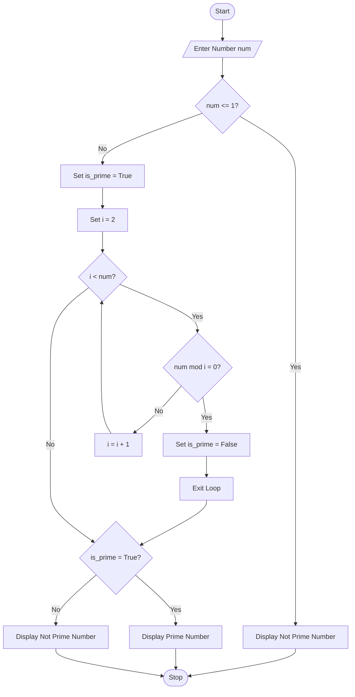

# Prime Number Checker Using Python

## 1. Problem Statement

Develop a Python program to determine whether a given number is a prime number.

A **prime number** is a natural number greater than 1 that has exactly two distinct positive divisors: 1 and itself.

Examples:

```text
2, 3, 5, 7, 11, 13, 17 ...
```

Non-prime numbers:

```text
4, 6, 8, 9, 10 ...
```

---

## 2. Algorithm

1. Start the program.
2. Read a number `n` from the user.
3. If `n` is less than or equal to 1:

   * Display "Not a Prime Number".
4. Otherwise:

   * Assume the number is prime.
   * Check divisibility from 2 to `n-1`.
   * If any number divides `n` exactly:

     * Mark it as not prime.
     * Stop checking further.
5. If no divisor is found:

   * Display "Prime Number".
6. Otherwise:

   * Display "Not a Prime Number".
7. Stop the program.

---

## 3. Flowchart



## 4. Python Source Code

```python
num = int(input("Enter a number: "))
if num <= 1:
    print(num, "is not a Prime Number")
else:
    is_prime = True
    for i in range(2, num):
        if num % i == 0:
            is_prime = False
            break
    if is_prime:
        print(num, "is a Prime Number")
    else:
        print(num, "is not a Prime Number")
```

---

## 5. Sample Input/Output

### Example 1

**Input**

```text
Enter a number: 13
```

**Output**

```text
13 is a Prime Number
```

---

### Example 2

**Input**

```text
Enter a number: 20
```

**Output**

```text
20 is not a Prime Number
```

---

### Example 3

**Input**

```text
Enter a number: 1
```

**Output**

```text
1 is not a Prime Number
```

---

## 6. Screenshots


