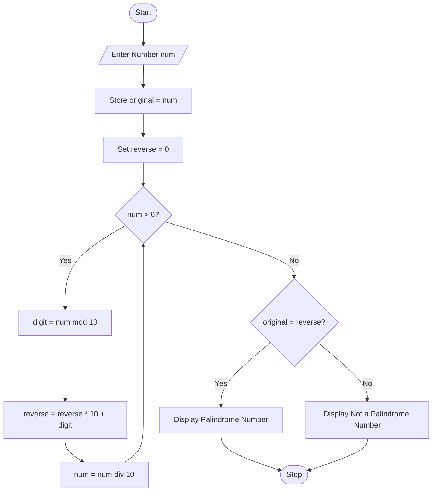

# Palindrome Number Checker Using Python

## 1. Problem Statement

Develop a Python program to check whether a given number is a palindrome.

A **palindrome number** is a number that remains the same when its digits are reversed.

Examples:

```text id="zt1vci"
121  → Palindrome
1331 → Palindrome
123  → Not a Palindrome
```

---

## 2. Algorithm

1. Start the program.
2. Input a number `n`.
3. Store the original number in a temporary variable.
4. Initialize `reverse = 0`.
5. Repeat while `n > 0`:

   * Extract the last digit using `n % 10`.
   * Append the digit to `reverse`.
   * Remove the last digit from `n`.
6. Compare the reversed number with the original number.
7. If both are equal:

   * Display "Palindrome Number".
8. Otherwise:

   * Display "Not a Palindrome Number".
9. Stop the program.

---

## 3. Flowchart



## 4. Python Source Code

```python
num = int(input("Enter a number: "))
original = num
reverse = 0
while num > 0:
    digit = num % 10
    reverse = reverse * 10 + digit
    num = num // 10
if original == reverse:
    print(original, "is a Palindrome Number")
else:
    print(original, "is not a Palindrome Number")
```

---

## 5. Sample Input/Output

### Example 1

**Input**

```text id="agj31l"
Enter a number: 121
```

**Output**

```text id="kekz5h"
121 is a Palindrome Number
```

---

### Example 2

**Input**

```text id="7bdgmh"
Enter a number: 123
```

**Output**

```text id="c5v2xt"
123 is not a Palindrome Number
```

---

### Example 3

**Input**

```text id="yuz0aj"
Enter a number: 1331
```

**Output**

```text id="y9g6h5"
1331 is a Palindrome Number
```

---

## 6. Screenshots

