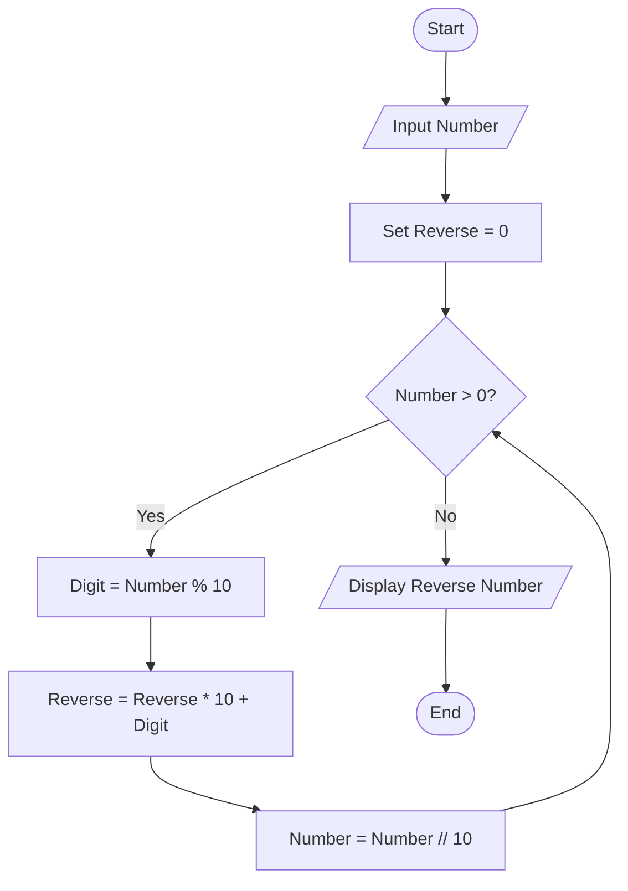
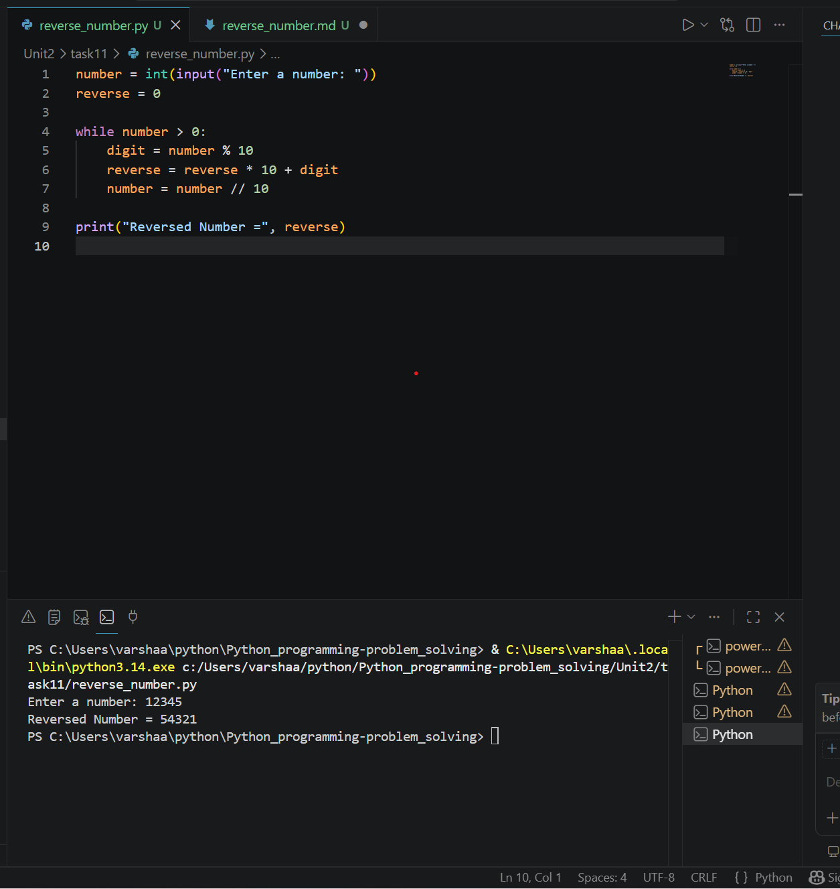

# Reverse a Number

## 1. Problem Statement

Develop a Python program to reverse the digits of a given number.

---

## 2. Algorithm

1. Start the program.
2. Input a number.
3. Initialize `reverse = 0`.
4. Repeat until the number becomes 0:

   * Extract the last digit using `number % 10`.
   * Add the digit to the reversed number.
   * Remove the last digit from the original number.
5. Display the reversed number.
6. End the program.

---

## 3. Flowchart



---

## 4. Python Source Code

```python
# Reverse a Number

number = int(input("Enter a number: "))
reverse = 0

while number > 0:
    digit = number % 10
    reverse = reverse * 10 + digit
    number = number // 10

print("Reversed Number =", reverse)
```

---

## 5. Sample Input/Output

### Sample Input

```text
Enter a number: 12345
```

### Sample Output

```text 
Reversed Number = 54321
```
### screenshot

