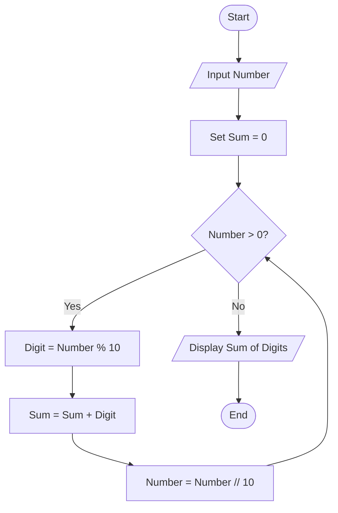
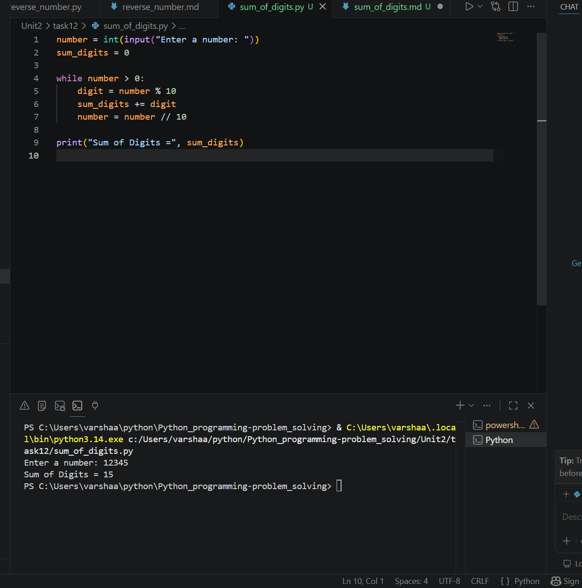

# Sum of Digits

## 1. Problem Statement

Develop a Python program to calculate the sum of digits of a given number.

---

## 2. Algorithm

1. Start the program.
2. Input a number.
3. Initialize `sum = 0`.
4. Repeat until the number becomes 0:

   * Extract the last digit using `number % 10`.
   * Add the digit to `sum`.
   * Remove the last digit using `number // 10`.
5. Display the sum of digits.
6. End the program.

---

## 3. Flowchart



---

## 4. Python Source Code

```python

number = int(input("Enter a number: "))
sum_digits = 0

while number > 0:
    digit = number % 10
    sum_digits += digit
    number = number // 10

print("Sum of Digits =", sum_digits)
```

---

## 5. Sample Input/Output

### Sample Input

```text 
Enter a number: 12345
```

### Sample Output

```text 
Sum of Digits = 15
```

### screenshot

