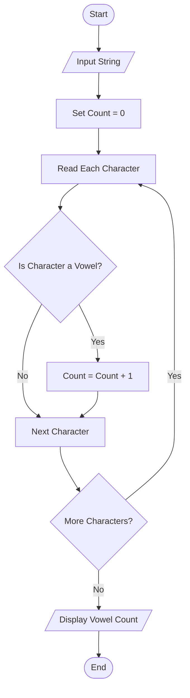
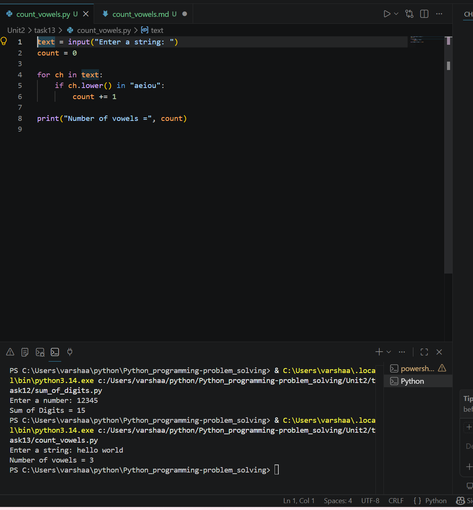

# Count Vowels in a String

## 1. Problem Statement

Develop a Python program to count the number of vowels present in a given string.

---

## 2. Algorithm

1. Start the program.
2. Input a string from the user.
3. Initialize vowel count as 0.
4. Traverse each character in the string.
5. Check whether the character is a vowel (`a, e, i, o, u` in either uppercase or lowercase).
6. If it is a vowel, increment the count.
7. Display the total number of vowels.
8. End the program.

---

## 3. Flowchart



---

## 4. Python Source Code

```python 
text = input("Enter a string: ")
count = 0

for ch in text:
    if ch.lower() in "aeiou":
        count += 1

print("Number of vowels =", count)
```

---

## 5. Sample Input/Output

### Sample Input

```text
Enter a string: Hello World
```

### Sample Output

```text 
Number of vowels = 3
```
### screenshot

