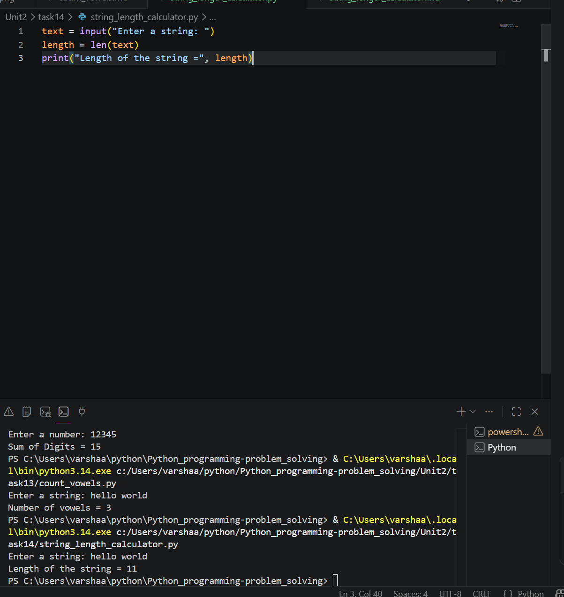

# String Length Calculator

## 1. Problem Statement

Develop a Python program to determine the length of a given string.

---

## 2. Algorithm

1. Start the program.
2. Input a string from the user.
3. Calculate the length of the string using the `len()` function.
4. Display the length of the string.
5. End the program.

---

## 3. Flowchart

```mermaid 
flowchart TD
    A([Start]) --> B[/Input String/]
    B --> C[Length = len(String)]
    C --> D[/Display Length/]
    D --> E([End])
```

---

## 4. Python Source Code

```python 

text = input("Enter a string: ")

length = len(text)

print("Length of the string =", length)
```

---

## 5. Sample Input/Output

### Sample Input

```text 
Enter a string: Hello World
```

### Sample Output

```text 
Length of the string = 11
```
### screenshot
