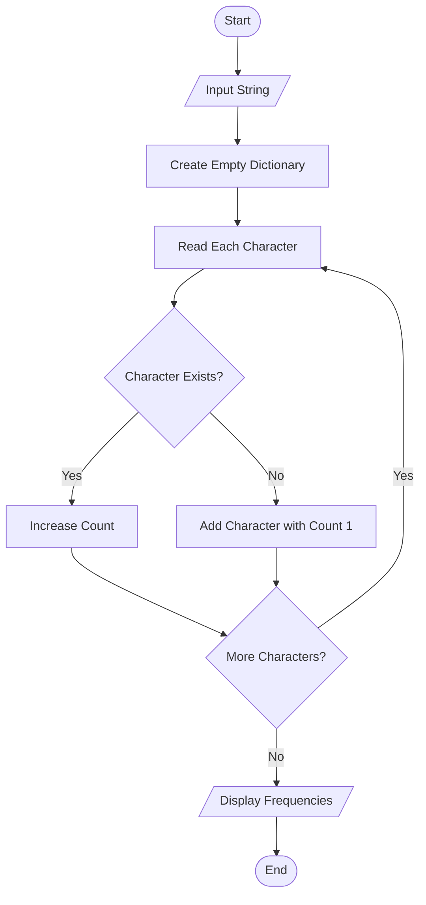
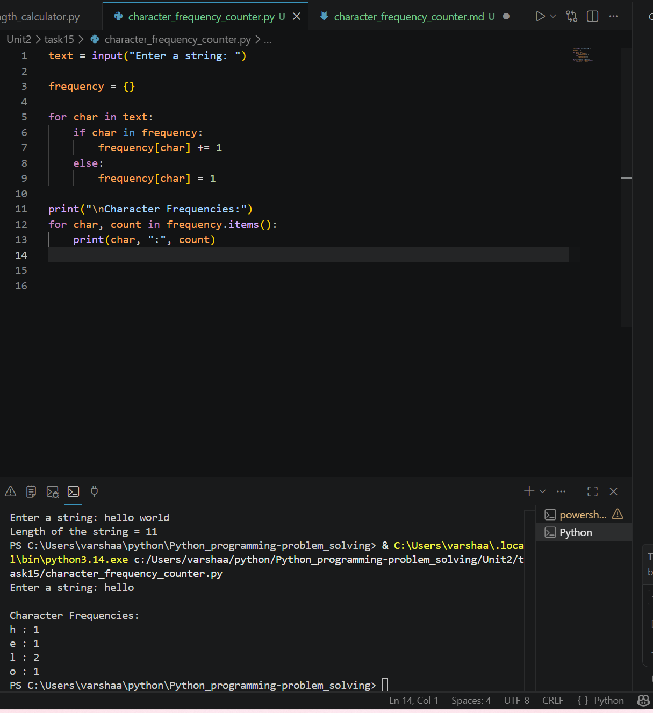

# Character Frequency Counter

## 1. Problem Statement

Develop a Python program to count the frequency of each character in a given string.

---

## 2. Algorithm

1. Start the program.
2. Input a string from the user.
3. Create an empty dictionary to store character frequencies.
4. Traverse each character in the string.
5. If the character already exists in the dictionary, increment its count.
6. Otherwise, add the character to the dictionary with a count of 1.
7. Display the frequency of each character.
8. End the program.

---

## 3. Flowchart



---

## 4. Python Source Code

```python 
# Character Frequency Counter

text = input("Enter a string: ")

frequency = {}

for char in text:
    if char in frequency:
        frequency[char] += 1
    else:
        frequency[char] = 1

print("\nCharacter Frequencies:")
for char, count in frequency.items():
    print(char, ":", count)
```

---

## 5. Sample Input/Output

### Sample Input

```text 
Enter a string: hello
```

### Sample Output

```text 
Character Frequencies:
h : 1
e : 1
l : 2
o : 1
```
### screenshot
