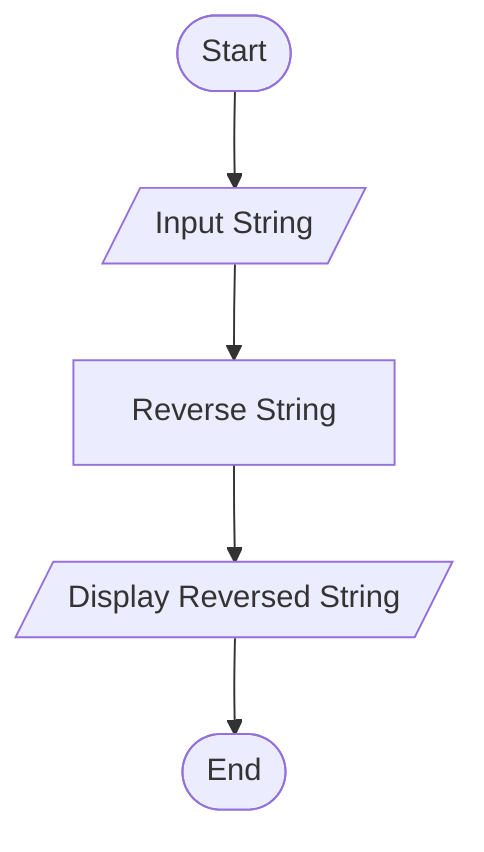
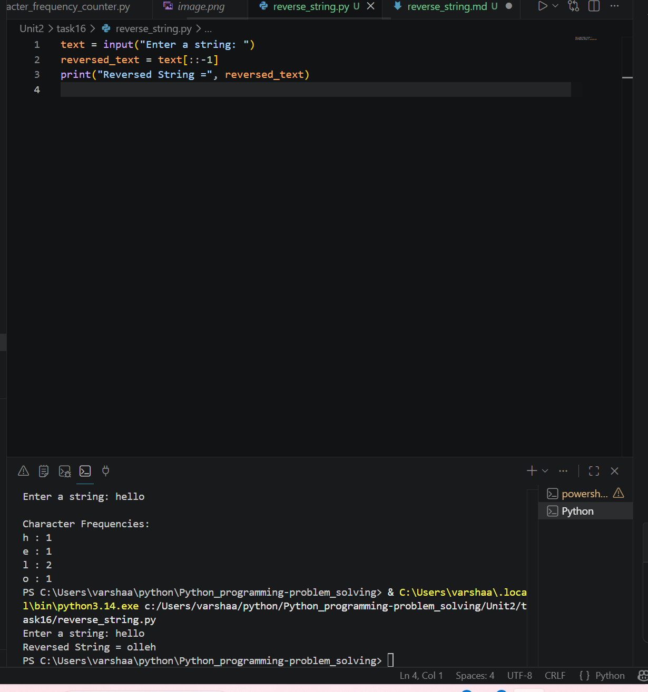

# Reverse a String

## 1. Problem Statement

Develop a Python program to reverse a given string and display the result.

---

## 2. Algorithm

1. Start the program.
2. Input a string from the user.
3. Reverse the string using slicing (`[::-1]`).
4. Display the reversed string.
5. End the program.

---

## 3. Flowchart



---

## 4. Python Source Code

text = input("Enter a string: ")

reversed_text = text[::-1]

print("Reversed String =", reversed_text)
```

---

## 5. Sample Input/Output

### Sample Input

```text 
Enter a string: Hello
```

### Sample Output

```text 
Reversed String = olleH
```
### screenshot
