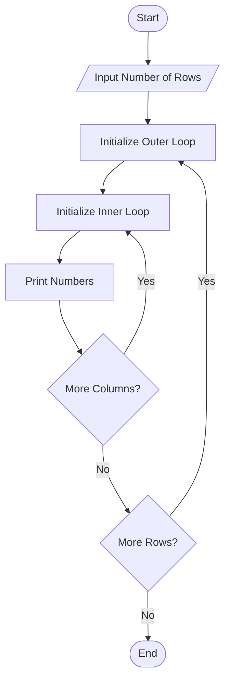
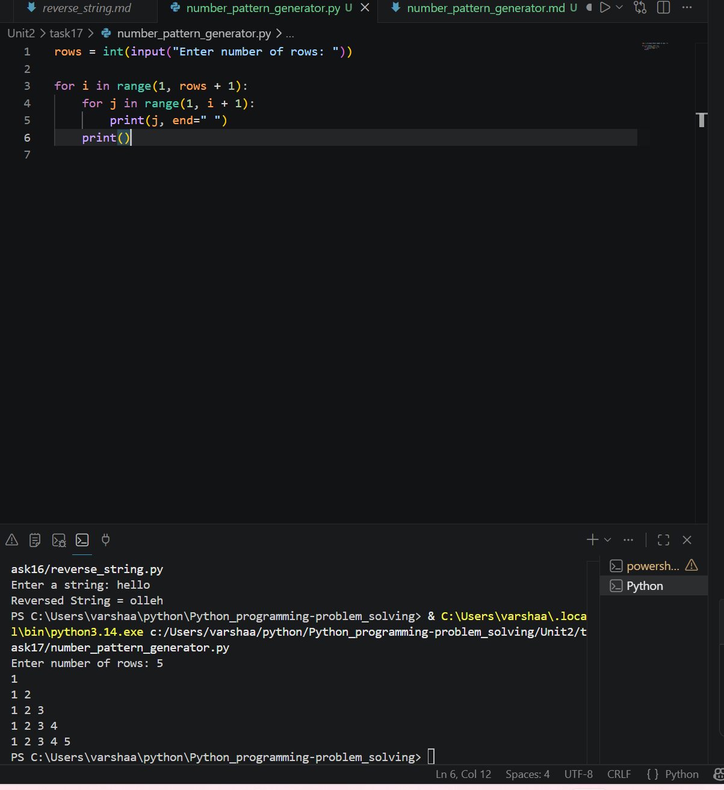

# Number Pattern Generator

## 1. Problem Statement

Develop a Python program to generate various number patterns using loops.

---

## 2. Algorithm

1. Start the program.
2. Input the number of rows.
3. Use nested loops to generate the number pattern.
4. Print numbers row by row.
5. Display the complete pattern.
6. End the program.

---

## 3. Flowchart



---

## 4. Python Source Code

rows = int(input("Enter number of rows: "))

for i in range(1, rows + 1):
    for j in range(1, i + 1):
        print(j, end=" ")
    print()
```

---

## 5. Sample Input/Output

### Sample Input

```text 
Enter number of rows: 5
```

### Sample Output

```text 
1
1 2
1 2 3
1 2 3 4
1 2 3 4 5
```
### screenshot

