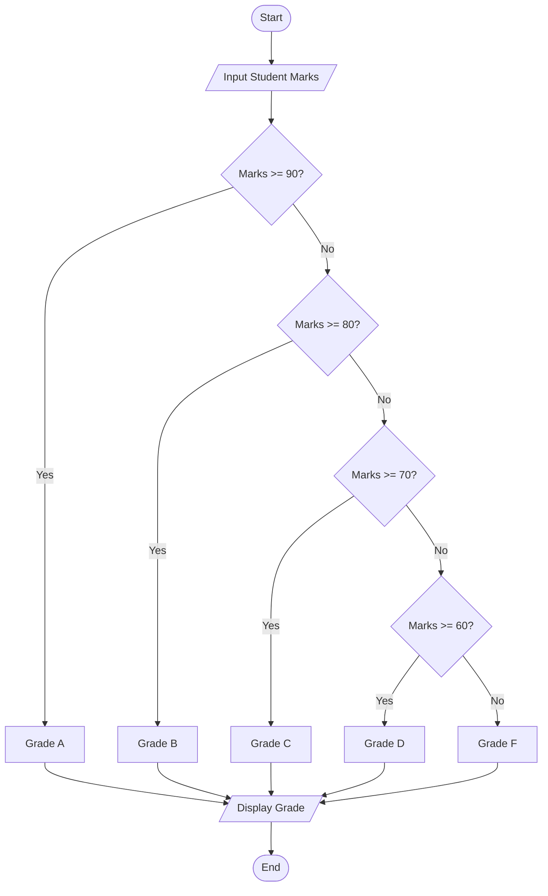
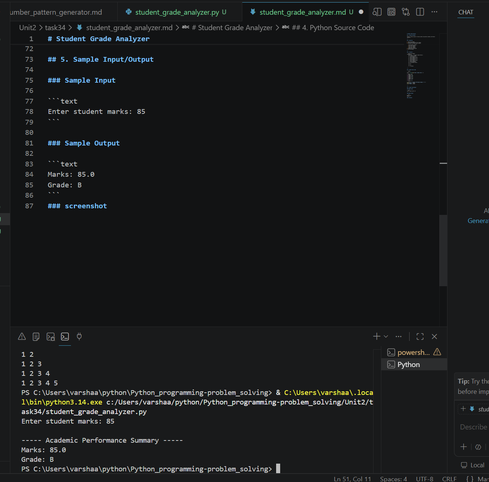

# Student Grade Analyzer

## 1. Problem Statement

Develop a Python program to analyze grades and generate academic performance summaries.

---

## 2. Algorithm

1. Start the program.
2. Input marks obtained by the student.
3. Calculate the grade based on marks:

   * 90 and above → Grade A
   * 80 to 89 → Grade B
   * 70 to 79 → Grade C
   * 60 to 69 → Grade D
   * Below 60 → Grade F
4. Display marks and grade.
5. End the program.

---

## 3. Flowchart



---

## 4. Python Source Code

```python 

marks = float(input("Enter student marks: "))

if marks >= 90:
    grade = "A"
elif marks >= 80:
    grade = "B"
elif marks >= 70:
    grade = "C"
elif marks >= 60:
    grade = "D"
else:
    grade = "F"

print("\n----- Academic Performance Summary -----")
print("Marks:", marks)
print("Grade:", grade)
```

---

## 5. Sample Input/Output

### Sample Input

```text
Enter student marks: 85
```

### Sample Output

```text 
Marks: 85.0
Grade: B
```
### screenshot

