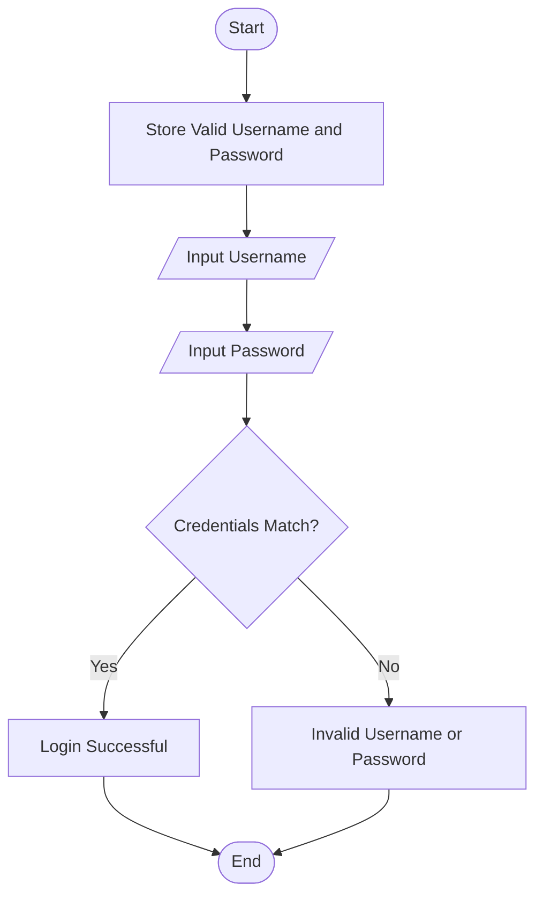
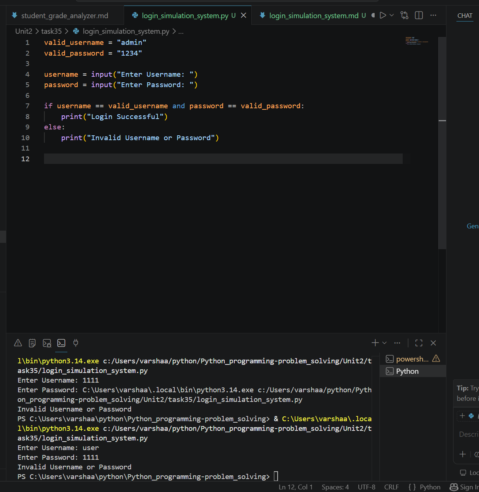

# Login Simulation System

## 1. Problem Statement

Develop a Python program that simulates user login using username and password validation.

---

## 2. Algorithm

1. Start the program.
2. Store a valid username and password.
3. Input username and password from the user.
4. Compare the entered credentials with the stored credentials.
5. If both match:

   * Display "Login Successful".
6. Otherwise:

   * Display "Invalid Username or Password".
7. End the program.

---

## 3. Flowchart



---

## 4. Python Source Code

```python

valid_username = "admin"
valid_password = "1234"

username = input("Enter Username: ")
password = input("Enter Password: ")

if username == valid_username and password == valid_password:
    print("Login Successful")
else:
    print("Invalid Username or Password")
```

---

## 5. Sample Input/Output

### Sample Input 1

```text
Enter Username: admin
Enter Password: 1234
```

### Sample Output 1

```text
Login Successful
```

### Sample Input 2

```text
Enter Username: user
Enter Password: 1111
```

### Sample Output 2

```text
Invalid Username or Password
```
### screenshot


