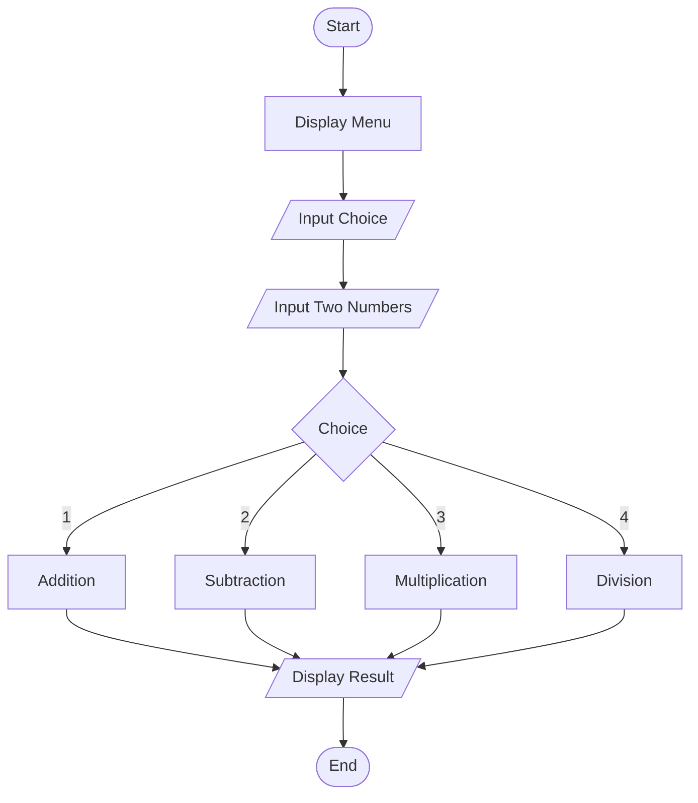
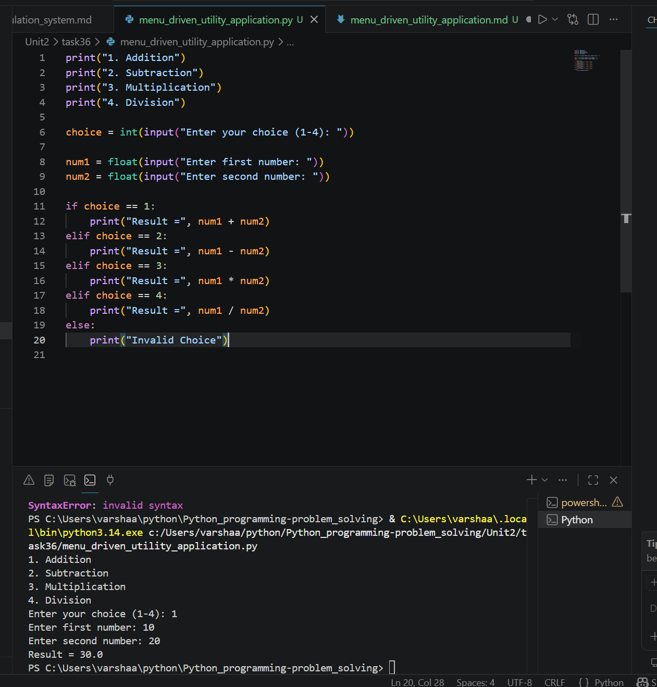

# Menu-Driven Utility Application

## 1. Problem Statement

Develop a Python menu-driven application that performs multiple operations based on user selection.

---

## 2. Algorithm

1. Start the program.
2. Display a menu with options:

   * Addition
   * Subtraction
   * Multiplication
   * Division
3. Input the user's choice.
4. Input two numbers.
5. Perform the selected operation.
6. Display the result.
7. End the program.

---

## 3. Flowchart



---

## 4. Python Source Code

```python

print("1. Addition")
print("2. Subtraction")
print("3. Multiplication")
print("4. Division")

choice = int(input("Enter your choice (1-4): "))

num1 = float(input("Enter first number: "))
num2 = float(input("Enter second number: "))

if choice == 1:
    print("Result =", num1 + num2)
elif choice == 2:
    print("Result =", num1 - num2)
elif choice == 3:
    print("Result =", num1 * num2)
elif choice == 4:
    print("Result =", num1 / num2)
else:
    print("Invalid Choice")
```

---

## 5. Sample Input/Output

### Sample Input

```text
1
10
20
```

### Sample Output

```text
Result = 30.0
```
### screenshot

