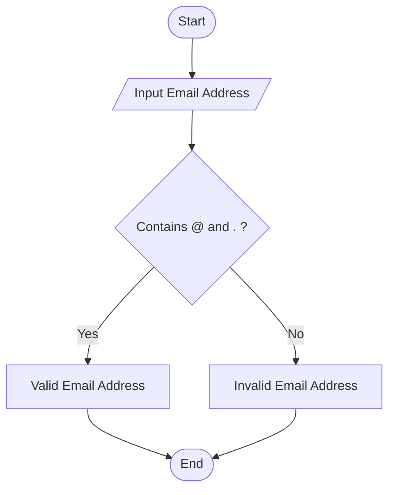
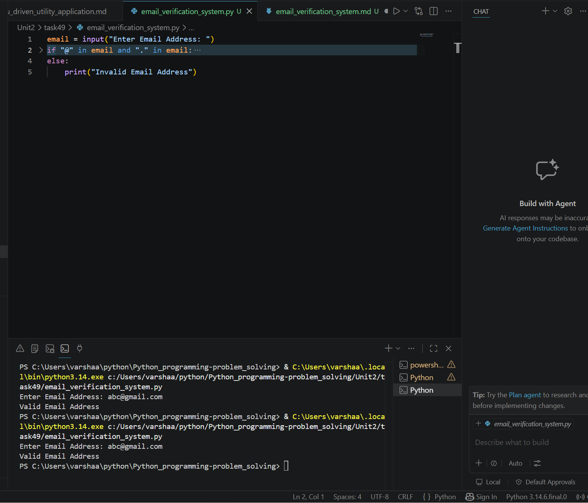

# Email Verification System

## 1. Problem Statement

Develop a Python application to verify email address formats and validity.

---

## 2. Algorithm

1. Start the program.
2. Input an email address.
3. Check whether the email contains '@' and '.'.
4. If both are present, display "Valid Email Address".
5. Otherwise, display "Invalid Email Address".
6. End the program.

---

## 3. Flowchart



---

## 4. Python Source Code

```python
email = input("Enter Email Address: ")

if "@" in email and "." in email:
    print("Valid Email Address")
else:
    print("Invalid Email Address")
```

---

## 5. Sample Input/Output

### Sample Input

```text
Enter Email Address: abc@gmail.com
```

### Sample Output

```text
Valid Email Address
```
### screenshot
