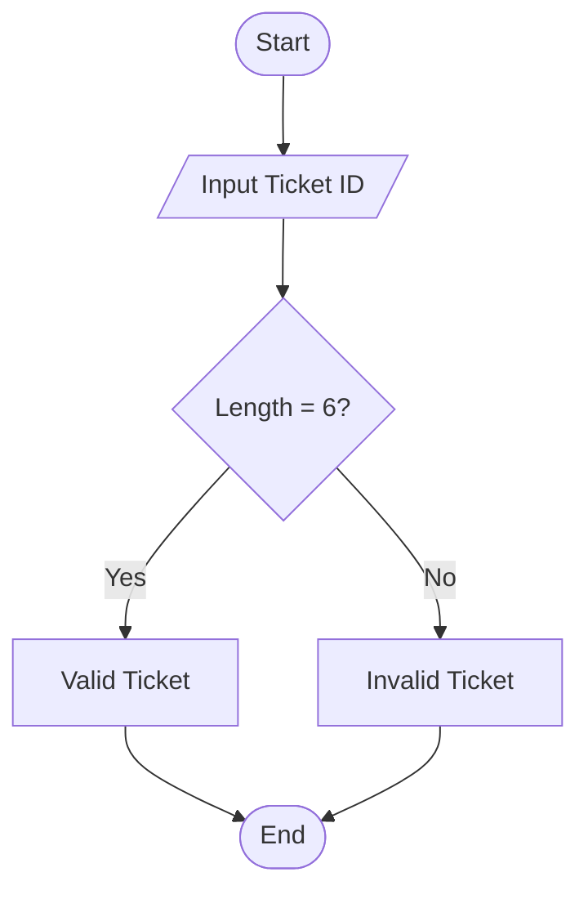
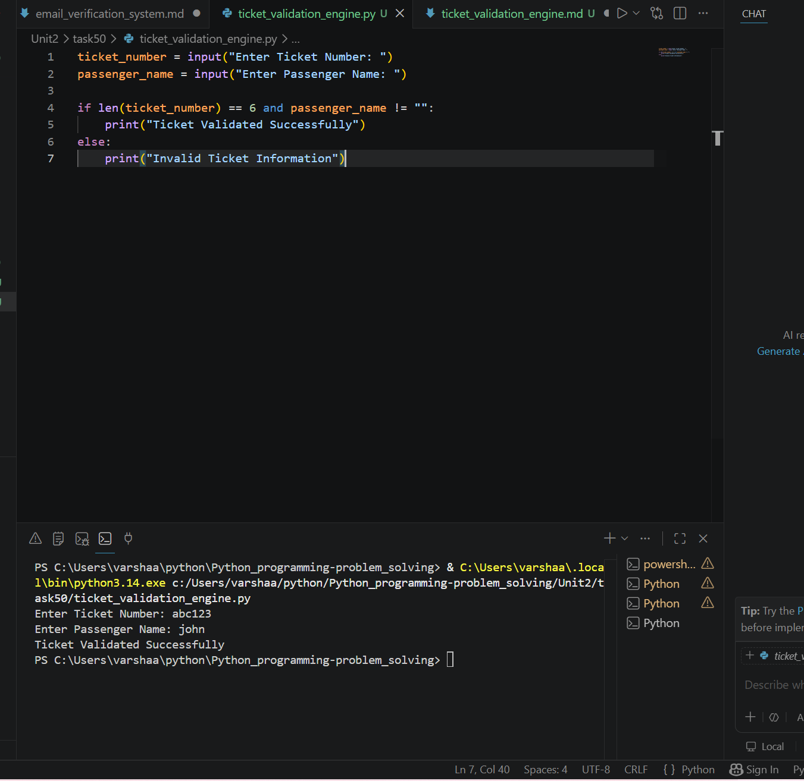

# Ticket Validation Engine

## 1. Problem Statement

Develop a Python application to validate ticket information for events and transportation systems.

---

## 2. Algorithm

1. Start the program.
2. Input the Ticket ID.
3. Check whether the Ticket ID length is 6 characters.
4. If the length is 6, display "Valid Ticket".
5. Otherwise, display "Invalid Ticket".
6. End the program.

---

## 3. Flowchart



---

## 4. Python Source Code

```python
ticket_id = input("Enter Ticket ID: ")

if len(ticket_id) == 6:
    print("Valid Ticket")
else:
    print("Invalid Ticket")
```

---

## 5. Sample Input/Output

### Sample Input

```text
Enter Ticket ID: ABC123
Enter Passenger Name: John
```

### Sample Output

```text
Valid Ticket
```
### screenshot
